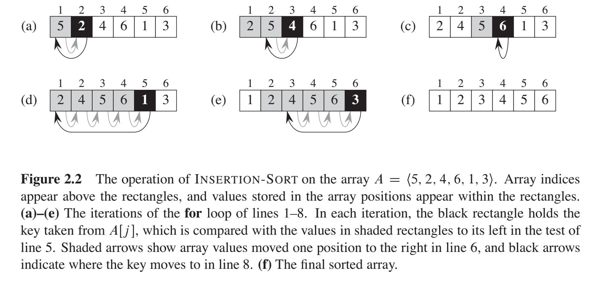
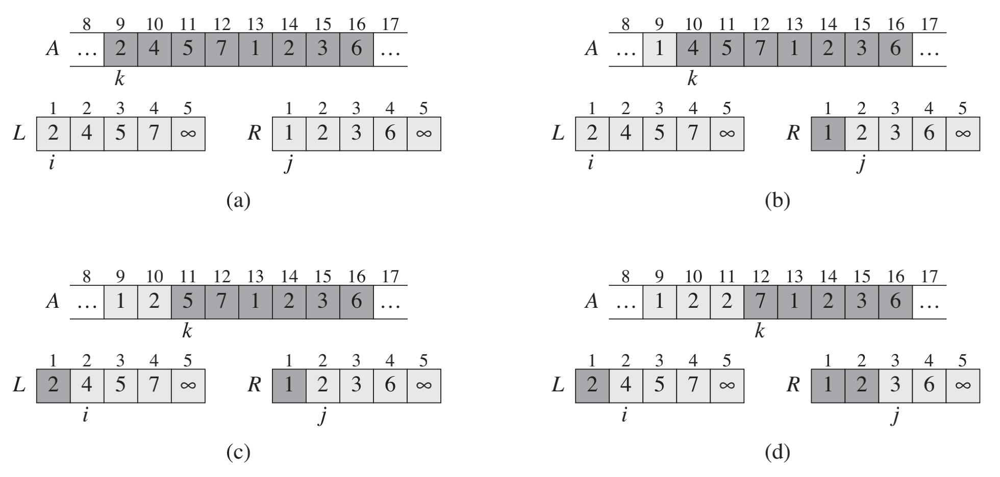
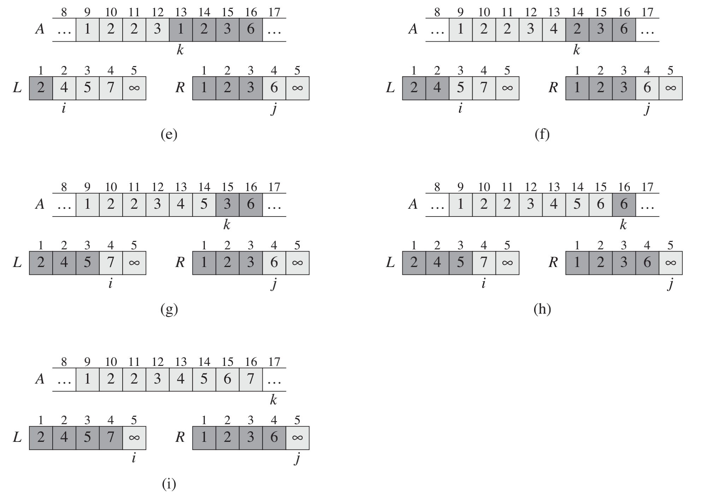
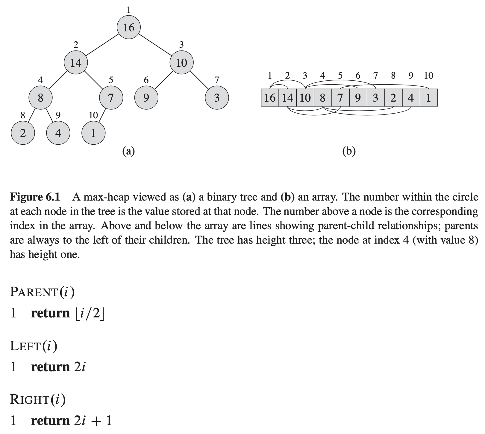
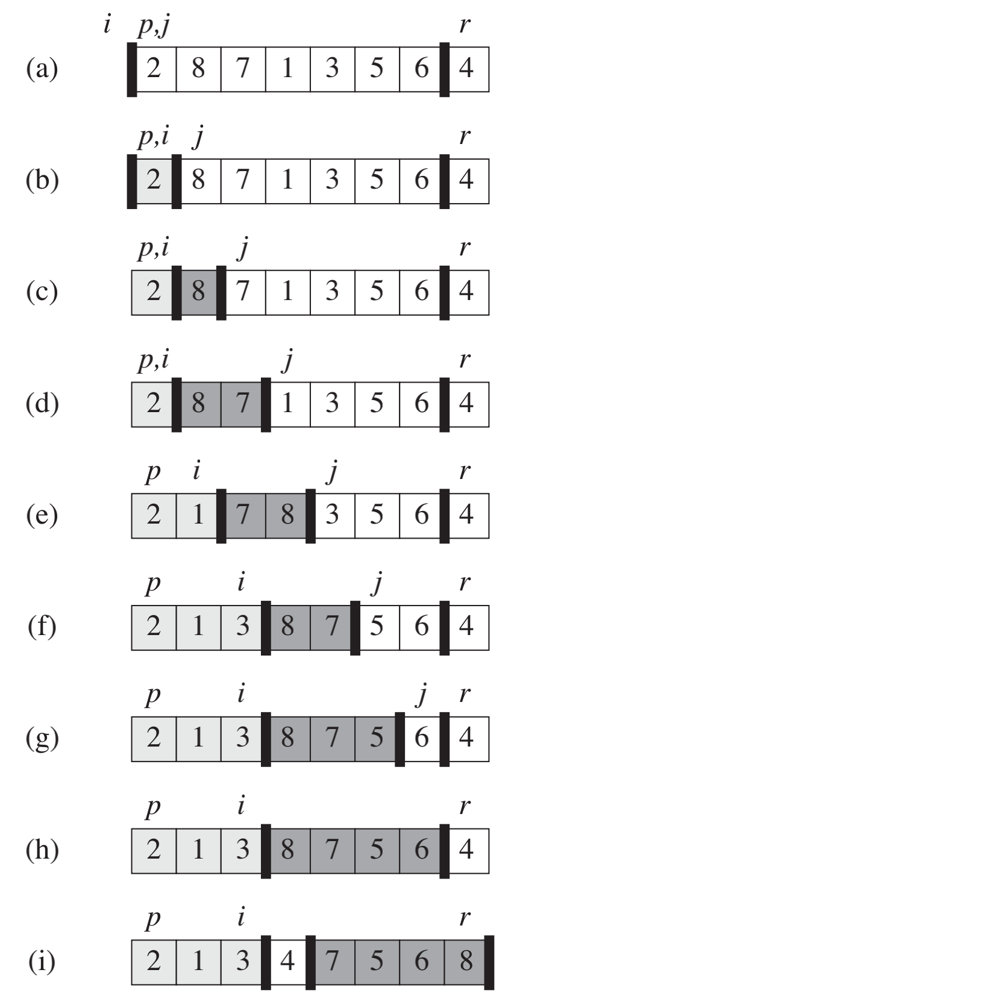
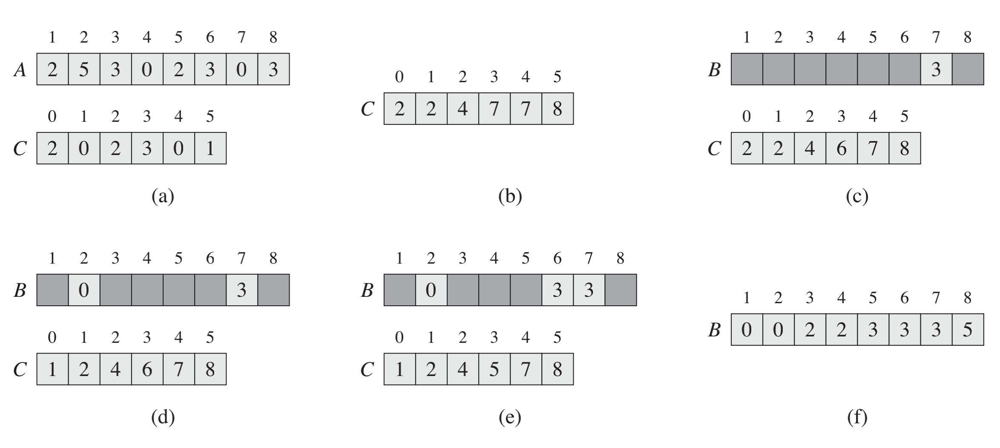
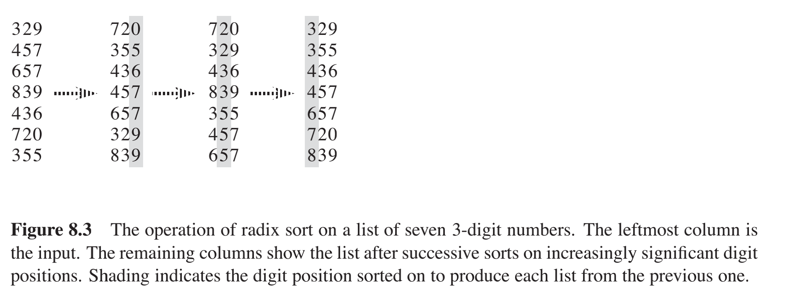
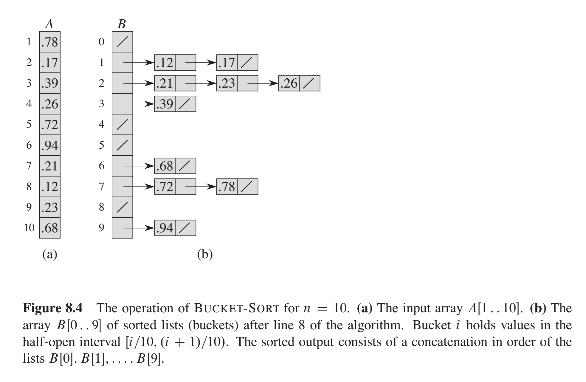

## Comparison Sort


### Insertion Sort



```java
public static void insertionSort(int[] array) {
    for (int i = 1; i < array.length; i++) {
        int current = array[i];
        int j = i - 1;
        // 先一个一个右移比current大的
        while(j >= 0 && current < array[j]) {
            array[j+1] = array[j];
            j--;
        }
        array[j+1] = current;
    }
}
```

### Selection Sort

一遍一遍找最小值

```java
public static void selectionSort(int[] array) {
    for (int i = 0; i < array.length; i++) {
        int min = array[i];
        int minId = i;
        for (int j = i+1; j < array.length; j++) {
            if (array[j] < min) {
                min = array[j];
                minId = j;
            }
        }
        // swapping
        int temp = array[i];
        array[i] = min;
        array[minId] = temp;
    }
}
```

### Bubble Sort

一遍一遍找最大值 并排到最后 时间复杂度 ```O(n^2)```


### Merge Sort





```java
public static void mergeSort(int[] array, int left, int right) {
    if (right <= left) return;
    int mid = (left+right)/2;
    mergeSort(array, left, mid);
    mergeSort(array, mid+1, right);
    merge(array, left, mid, right);
}

private static void merge(int[] array, int left, int mid, int right) {
    int lengthLeft = mid - left + 1;
    int lengthRight = right - mid;

    int leftArray[] = new int [lengthLeft];
    int rightArray[] = new int [lengthRight];

    for (int i = 0; i < lengthLeft; i++)
        leftArray[i] = array[left+i];
    for (int i = 0; i < lengthRight; i++)
        rightArray[i] = array[mid+i+1];

    int leftIndex = 0;
    int rightIndex = 0;

    for (int i = left; i < right + 1; i++) {
        if (leftIndex < lengthLeft && rightIndex < lengthRight) {
            if (leftArray[leftIndex] < rightArray[rightIndex]) {
                array[i] = leftArray[leftIndex];
                leftIndex++;
            }
            else {
                array[i] = rightArray[rightIndex];
                rightIndex++;
            }
        }
        else if (leftIndex < lengthLeft) {
            array[i] = leftArray[leftIndex];
            leftIndex++;
        }
        else if (rightIndex < lengthRight) {
            array[i] = rightArray[rightIndex];
            rightIndex++;
        }
    }
}
```

### Heap Sort



```java
private static void heapify(int[] array, int length, int i) {
    int leftChild = 2*i+1;
    int rightChild = 2*i+2;
    int largest = i;

    if (leftChild < length && array[leftChild] > array[largest]) {
        largest = leftChild;
    }
    if (rightChild < length && array[rightChild] > array[largest]) {
        largest = rightChild;
    }
    if (largest != i) {
        int temp = array[i];
        array[i] = array[largest];
        array[largest] = temp;
        heapify(array, length, largest);
    }
}

public static void heapSort(int[] array) {
    if (array.length == 0) return;
    int length = array.length;
    for (int i = length / 2-1; i >= 0; i--)
        heapify(array, length, i);
    // 从小到大排，每次取出堆的最大，也就是index为0的值
    for (int i = length-1; i >= 0; i--) {
        int temp = array[0];
        array[0] = array[i];
        array[i] = temp;
        heapify(array, i, 0);
    }
}
```

### Quick Sort

每次partition都将小于r的放到一侧，大于r的放到另一侧



```java
static int partition(int[] array, int begin, int end) {
    int pivot = end;
    int counter = begin;
    for (int i = begin; i < end; i++) {
        if (array[i] < array[pivot]) {
            int temp = array[counter];
            array[counter] = array[i];
            array[i] = temp;
            counter++;
        }
    }
    int temp = array[pivot];
    array[pivot] = array[counter];
    array[counter] = temp;
    return counter;
}

public static void quickSort(int[] array, int begin, int end) {
    if (end <= begin) return;
    int pivot = partition(array, begin, end);
    quickSort(array, begin, pivot-1);
    quickSort(array, pivot+1, end);
}
```

---

## Counting Sort

A:原序列 B：排序序列 C：中间记录index的序列



```java
public static void countSort(int[] arr) {
    int max = Arrays.stream(arr).max().getAsInt();
    int min = Arrays.stream(arr).min().getAsInt();
    int range = max - min + 1;
    int count[] = new int[range];
    int output[] = new int[arr.length];
    // 计数
    for (int i = 0; i < arr.length; i++) {
        count[arr[i] - min]++;
    }
    // 累计变成index
    for (int i = 1; i < count.length; i++) {
        count[i] += count[i - 1];
    }
    // count中的数每被查询一次，index往前移一个
    for (int i = arr.length - 1; i >= 0; i--) {
        output[count[arr[i] - min] - 1] = arr[i];
        count[arr[i] - min]--;
    }
    // 更改原序列
    for (int i = 0; i < arr.length; i++) {
        arr[i] = output[i];
    }
}
```

---

## Radix Sort




---

## Bucket Sort



```java
// Default_Interval 默认值为10
public static int[] bucketSort(int array[], int Default_Interval) {

    if (array == null || array.length <= 0) {
        return null;
    }
    //获得最大值,最小值,
    int min, max;
    min = array[0];
    max = array[1];
    for (int a : array) {
        if (a > max) {
            max = a;
        } else if (a < min) {
            min = a;
        }
    }
    // 计算出桶数,并根据默认的间隔创建桶,将数据填入桶中
    int bucketNum = (max - min) / Default_Interval + 1;
    ArrayList<Integer>[] buckets = new ArrayList[bucketNum];
    for (int i = 0; i < buckets.length; i++) {
        buckets[i] = new ArrayList<Integer>();
    } 
    for (int a : array) {
        int index = (a - min) / Default_Interval;
        buckets[index].add(a);
    }
    // 对每个桶中的数据进行排序
    for (ArrayList bucket : buckets) {
        Collections.sort(bucket);
    }
    // 将桶中元素赋值到原来数列中
    int index = 0;
    for (ArrayList<Integer> bucket : buckets) {
        for (int i = 0; i < bucket.size(); i++) {
            array[index++] = bucket.get(i);
        }
    }
    return array;
}
```