## 栈Stack
### 特点
- LIFO: Last In, First Out 后进先出
- 相关操作: ```EMPTY```, ```PUSH```, ```POP```
- Java
```java
public void StackTest(){
    Stack<Integer> stack = new Stack<>();
    // push
    stack.push(1);
    System.out.println("stack.push(1): " + stack);
    stack.push(2);
    System.out.println("stack.push(2): " + stack);
    // peek
    System.out.println("stack.peek(): " + stack.peek());
    // pop
    System.out.println("stack.pop(): " + stack.pop());
    System.out.println("after pop operation: " + stack);
    // empty
    System.out.println("stack.empty(): " + stack.empty());
}
```

### 例题

20. Valid Parentheses
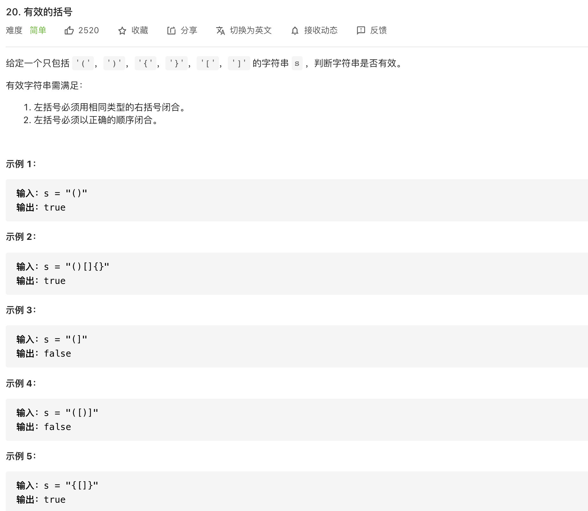

```java
class Solution {
    public boolean isValid(String s) {
	Stack<Character> stack = new Stack<Character>();
	for (char c : s.toCharArray()) {
		if (c == '(')
			stack.push(')');
		else if (c == '{')
			stack.push('}');
		else if (c == '[')
			stack.push(']');
		else if (stack.empty() || stack.pop() != c)
			return false;
	    }
	return stack.empty();
    }
}
```

1047. Remove All Adjacent Duplicates In String
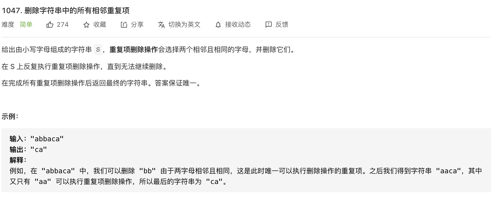

```java
class Solution {
    public String removeDuplicates(String s) {
        Stack<Character> stack = new Stack<Character>();
        StringBuilder sb = new StringBuilder();
        for (char ch:s.toCharArray()){
            if (stack.isEmpty()) {
                stack.push(ch);
            } else if (stack.peek() == ch) {
                stack.pop();
            } else {
                stack.push(ch);
            }
        }
        while (!stack.isEmpty()){
            sb.insert(0,stack.pop());
        }
        return sb.toString();
    }
}
```


## 队列 Queue
### 特点
- FIFO: 先进先出
- 相关操作：```ENQUEUE```, ```DEQUEUE```
- Java

```java
public void QueueTest() {
    Queue<Integer> queue = new LinkedList<>();
    // enqueue
    queue.add(1);
    queue.add(2);
    System.out.println(queue);
    // peek
    System.out.println("queue.peek(): " + queue.peek());
    System.out.println(queue);
    // dequeue
    System.out.println("queue.poll(): " + queue.poll());
    System.out.println(queue);
}
```


---

## 图的一些概念
- Source/Sink Vertex
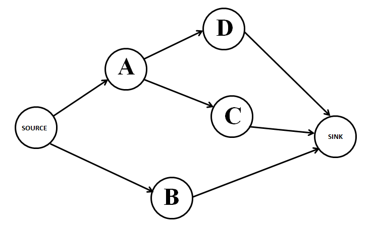

- 有向图
- 有向无环图（DAG）
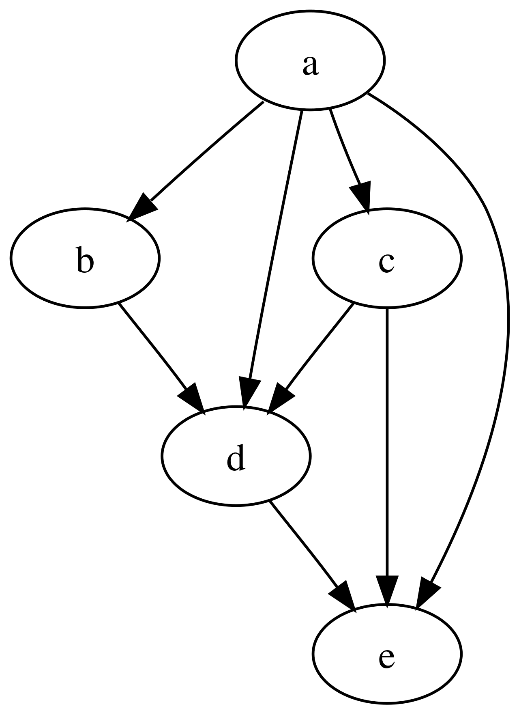

## BFS 广度优先搜索
### 原理
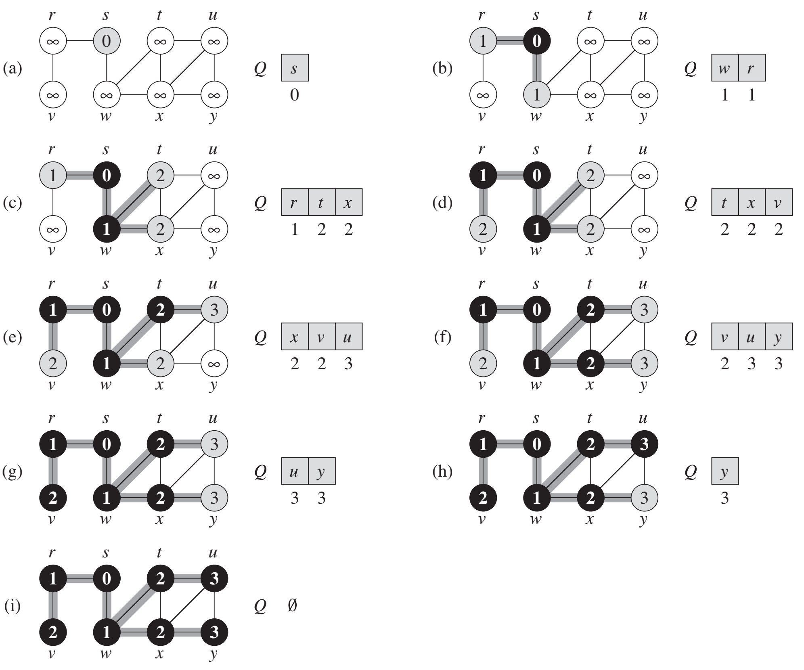

### 应用
- 最短路径

### 例题
102. Binary Tree Level Order Traversal
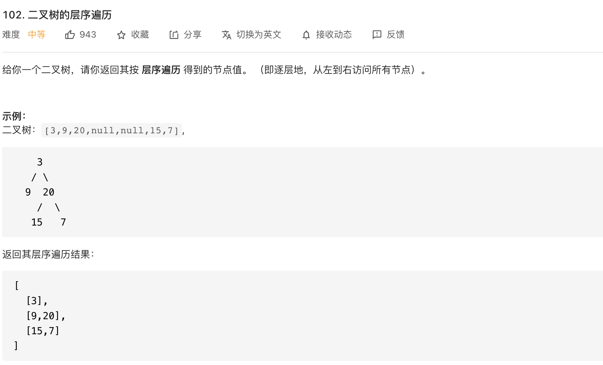

```java
/**
 * Definition for a binary tree node.
 * public class TreeNode {
 *     int val;
 *     TreeNode left;
 *     TreeNode right;
 *     TreeNode() {}
 *     TreeNode(int val) { this.val = val; }
 *     TreeNode(int val, TreeNode left, TreeNode right) {
 *         this.val = val;
 *         this.left = left;
 *         this.right = right;
 *     }
 * }
 */
public class Solution {
    public List<List<Integer>> levelOrder(TreeNode root) {
        Queue<TreeNode> queue = new LinkedList<TreeNode>();
        List<List<Integer>> wrapList = new LinkedList<List<Integer>>();
        
        if(root == null) return wrapList;
        
        queue.offer(root);
        while(!queue.isEmpty()){
            int levelNum = queue.size();
            List<Integer> subList = new LinkedList<Integer>();
            for(int i=0; i<levelNum; i++) {
                if(queue.peek().left != null) queue.offer(queue.peek().left);
                if(queue.peek().right != null) queue.offer(queue.peek().right);
                subList.add(queue.poll().val);
            }
            wrapList.add(subList);
        }
        return wrapList;
    }
}
```

## DFS 深度优先搜索
### 原理

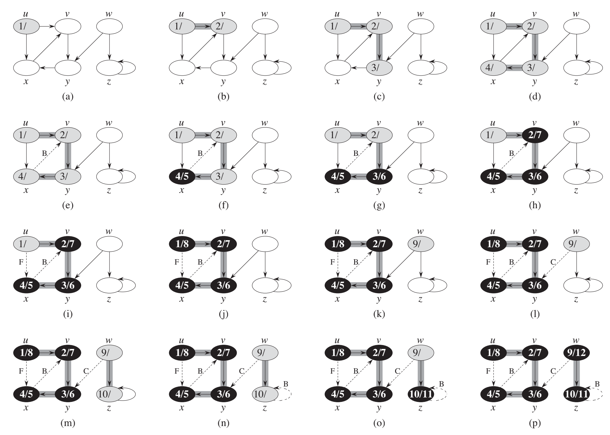

### 应用
- 找关联的节点
- 拓扑排序

https://blog.csdn.net/lisonglisonglisong/article/details/45543451
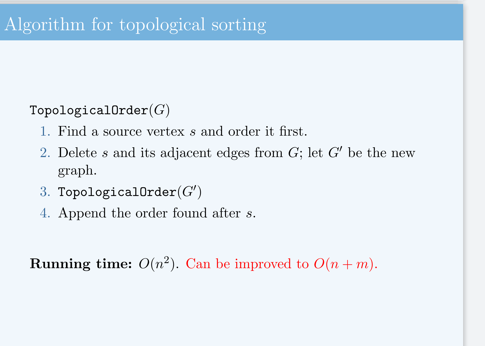

https://www.cs.usfca.edu/~galles/visualization/TopoSortDFS.html
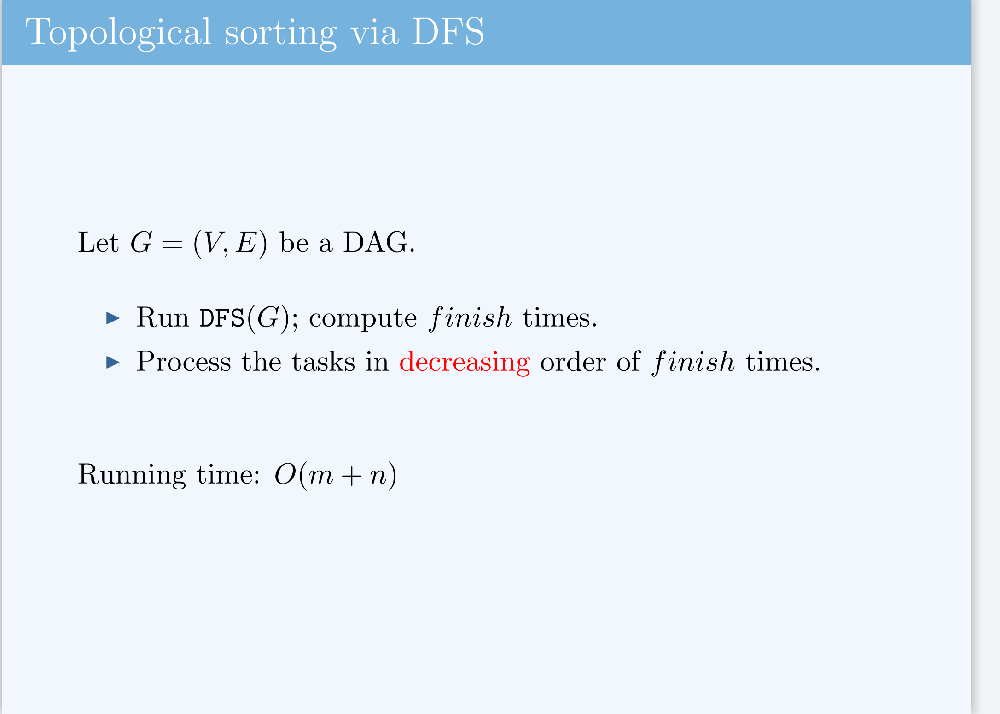

- 闭环检测

### 例题

200. Number of Islands

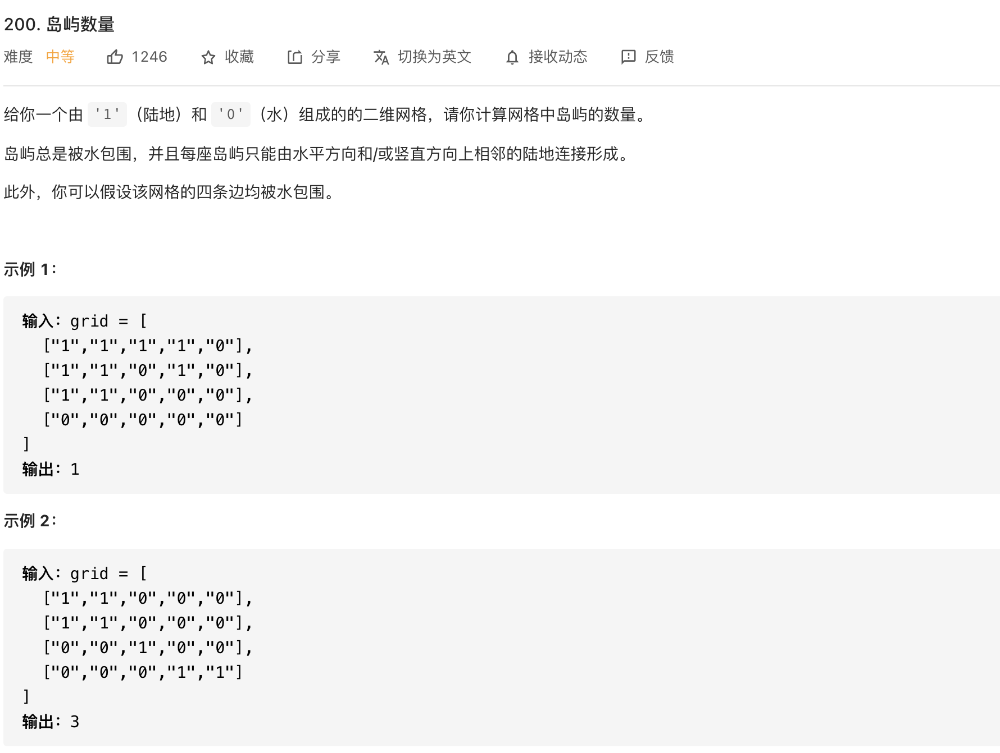

```java
class Solution {

    private int n;
    private int m;

    public int numIslands(char[][] grid) {
        int count = 0;
        n = grid.length;
        if (n == 0) return 0;
        m = grid[0].length;
        for (int i = 0; i < n; i++){
            for (int j = 0; j < m; j++)
                if (grid[i][j] == '1') {
                    dfs(grid, i, j);
                    ++count;
                }
        }    
        return count;
    }

    private void dfs(char[][] grid, int i, int j) {
        if (i < 0 || j < 0 || i >= n || j >= m || grid[i][j] != '1') return;
        grid[i][j] = '0';
        dfs(grid, i + 1, j);
        dfs(grid, i - 1, j);
        dfs(grid, i, j + 1);
        dfs(grid, i, j - 1);
    }
}
```

695. Max Area of Island

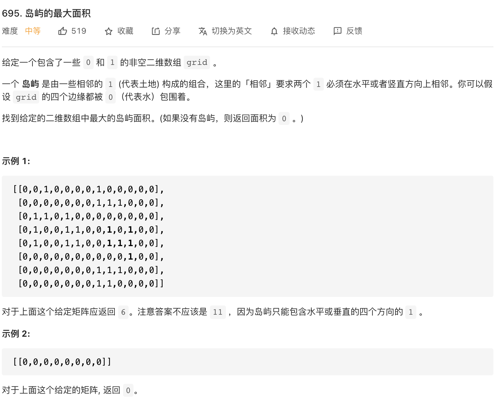

```java
class Solution {
    public int maxAreaOfIsland(int[][] grid) {
        if (grid == null || grid.length == 0) {
            return 0;
        }
        int m = grid.length;
        int n = grid[0].length;
        int max = 0;
        for (int i = 0; i < m; i++) {
            for (int j = 0; j < n; j++) {
                if (grid[i][j] == 1) {
                    int area = dfs(grid, i, j, m, n, 0);
                    max = Math.max(area, max);
                }
            }
        }
        return max;
    }

    int dfs(int[][] grid, int i, int j, int m, int n, int area) {
        if (i < 0 || i >= m || j < 0 || j >= n || grid[i][j] == 0) {
            return area;
        }
        grid[i][j] = 0;
        area++;
        area = dfs(grid, i + 1, j, m, n, area);
        area = dfs(grid, i, j + 1, m, n, area);
        area = dfs(grid, i - 1, j, m, n, area);
        area = dfs(grid, i, j - 1, m, n, area);
        return area;
    }
}
```