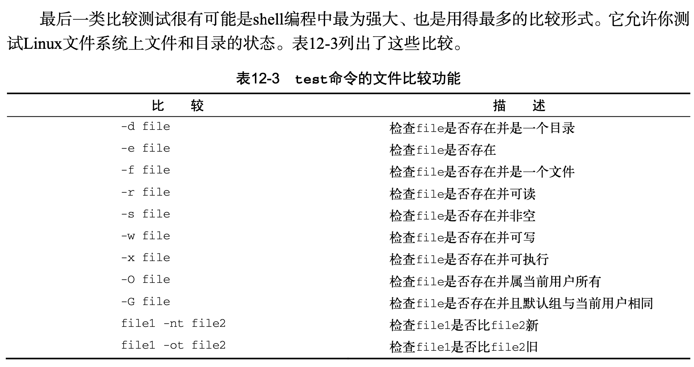

<h1 align="center">Linux命令与shell脚本编程大全 cheatsheet</h1>

### Contents
- **第一部分 Linux 命令行**
    - [3 基本的bash shell命令](#3)
    - [4 更多的bash shell命令](#4)
    - [5 理解shell](#5)
    - [6 使用Linux环境变量](#6)
    - [7 理解Linux文件权限](#7)
    - [8 理解文件系统](#8)
    - [9 安装程序软件](#9)
    - [10 使用编辑器](#10)
- **第二部分 shell脚本编程基础**
    - [11 构建基本脚本](#11)
    - [12 使用结构化命令](#12)
    - [13 更多的结构化命令](#13)
    - [14 处理用户输入](#14)
    - [15 呈现数据](#15)
    - [16 控制脚本](#16)
- **第三部分 高级shell脚本编程**
    - [17 创建函数](#17)
    - [18 图形化桌面环境中的脚本编程](#18)
    - [19 初识sed和gawk](#19)
    - [20 正则表达式](#20)
    - [21 sed进阶](#21)
    - [22 gawk进阶](#22)
    - [23 使用其他shell](#23)
- **第四部分 创建实用的脚本**
    - [24 编写简单的脚本实用工具](#24)
    - [25 创建与数据库、web及电子邮件相关的脚本](#25)
    - [26 一些小有意思的脚本](#26)

---
<h1 align="center">第一部分 Linux 命令行</h1>

## 3. 基本的bash shell命令 <a id="3"> </a>

**bash手册**
- 查看与手册页相关的手册页:```man man```, ```q```退出
- 不记得命令名，可以使用关键字搜索手册页：```man -k```，如```man -k terminal```

**目录**


- 切换目录 ```cd destination```，可用绝对路径和相对路径
- 当前工作路径：```pwd```
- 当前目录：单点符(```.```)
- 当前目录的父目录：双点符(```..```)

**文件和目录列表**
|命令                   |含义                                   |
|-----------------------|--------------------------------------|
|```ls```               |显示当前目录下的文件和目录                 |
|```ls -F```            |区分文件和目录                           |
|```ls -a```            |现实隐藏文件                            |
|```ls -R```            |列出了当前目录下包含的子目录中的文件，递归选项|
|```ls -l```            |显示常列表，包含更多信息                  |
|```ls -l my_script```  |过滤文件                                |
|```ls -l my_scr?pt```  |问号(```?```)代表一个字符                |
|```ls -l my*```        |星号(```*```)代表零个或多个字符           |
|```ls -l f[ai]ll```    |匹配fall或fill                         |
|```ls -l f[!a]ll```    |匹配非fall的其他f?ll                    |

**处理文件**
|命令                            |含义                 |
|-------------------------------|---------------------|
|```touch filename```           |创建                  |
|```cp source destination```    |复制                  |
|```cp -i source destination``` |复制并询问是否覆盖      |
|```cp -i test_one Documents/```|复制到文件夹           |
|```cp -R folder1/ folder2```   |复制文件夹里的所有东西   |
|```mv file folder/```          |移动文件              |
|```mv file1 file2```           |重命名文件             |
|```mv folder1 folder2```       |重命名文件             |
|```rm -i file```               |删除文件              | 
- 补全：用制表键```tab```
- 链接文件


**处理目录**

|命令                                     |含义                 |
|----------------------------------------|---------------------|
|```mkdir New_Dir```                     |创建新的目录           |
|```mkdir -p New_Dir/Sub_dir/Under_dir```|创建多个目录和子目录    |
|```rmdir```                             |删除空目录             |
|```rm -ri My_Dir```                     |删除目录及其文件        |
|```tree Small_Dir```                    |展示目录结构           |
|```rm -rf Small_Dir```                  |无提示删除             |


**查看文件内容**
|命令                    |含义                            |
|-----------------------|--------------------------------|
|```file my_file```     |查看文件和编码类型                 |
|```cat -n file```      |查看整个文件, 加上行号             |
|```cat -b file```      |只给文本加上行号                   |
|```cat -T file```      |```^I```代替制表符                |
|```more file```        |可以不全显示                      |
|```less file```        |less is more, more的进阶版       |
|```tail file```        |查看文件后10行                    |
|```tail -n 2 file```   |查看后2行 等价于```tail -2 file```|
|```head file```        |查看文件前10行                    |
|```head -5 file```     |查看前5行                        |


## 4. 更多的bash shell命令 <a id="4"> </a>

**检测程序**

- ```ps```: 查看进程

|扩展列|含义                  |
|-----|----------------------|
|UID  |启动这些进程的用户       |
|PID  |进程的进程ID           |
|PPID |父进程的进程号          |
|C    |进程生命周期中的CPU利用率|
|STIME|进程启动时的系统时间     |
|TTY  |进程启动时的终端设备     |
|TIME |运行进程需要的累计CPU时间|
|CMD  |启动的程序名称          |

- ```ps -l```: 查看更多信息

|扩展列|含义                  |
|-----|----------------------|
|F    |内核分配给进程的系统标记  |
|S    |进程的状态(O代表正在运行;S代表在休眠;R代表可运行，正等待运行;Z代表僵化，进程已结束但父进程已不存在;T代表停止)|
|PRI  |进程的优先级(越大的数字代表越低的优先级)|
|NI   |谦让度值用来参与决定优先级|
|ADDR |进程的内存地址          |
|SZ   |假如进程被换出，所需交换空间的大致大小|
|WCHAN|进程休眠的内核函数的地址 |

- 结束进程
    - ```kill PID```: 用PID结束进程
    - ```killall http*```: 用进程名结束进程


**检测磁盘空间**

|命令                            |含义                    |
|-------------------------------|------------------------|
|```mount```                    |输出当前系统上挂在的设备列表|
|```umount [directory|device]```|卸载设备                 |
|```df -h```                    |查看磁盘空间，易读模式     |
|```du```                       |当前目录下所有的文件、目录和子目录的磁盘使用情况|

**处理数据文件**
|命令                                  |含义                    |
|-------------------------------------|------------------------|
|```sort file```                      |字符排序                 |
|```sort -n file```                   |按数值排序               |
|```sort -M file```                   |三字符的月份名排序         |
|```sort -t ':' -k 3 -n /etc/passwd```|分隔符":"，第三列，按照数字排序|
|```grep pattern file```              |搜索某种pattern所在行，可用正则|
|```grep -v t file1```                |反向搜索不包含的行         |
|```grep -c t file1```                |返回包含的行数            |
|```grep -e t -e f file1```           |所搜多种pattern          |
|```gzip```                           |压缩                     |
|```tar```                            |归档数据处理              |


## 5. 理解shell <a id="5"> </a>

```history```, ```!!```：查看最近的命令


## 6. 使用Linux环境变量 <a id="6"> </a>

**全局变量**

|命令                                       |含义           |
|------------------------------------------|---------------|
|```printenv```, ```evn```                 |查看全局变量     |
|```printenv HOME```, ```echo $HOME```     |查看个别环境变量  |
|```ls $HOME``` = ```ls /Users/zhijunliu```|变量用作命令行参数|


**局部变量**


- 生成局部变量 及其 特点


- ```export my_variable```: 变成全局变量，子shell中```export```不影响父shell的结果
- ```unset my_variable```: 删除环境变量，子shell中删除，父shell中仍可用
- ```PATH=$PATH:new_path```: 添加新的路径至PATH变量
- ```/etc/profile```文件是bash shell默认的的主启动文件
- ```$HOME```目录下的启动文件: ``` $HOME/.bash_profile```, ```$HOME/.bashrc```, ```$HOME/.bash_login```, ```$HOME/.profile```
- 数组变量

## 7. 理解Linux文件权限 <a id="7"> </a>

**Linux安全性**

- ```/etc/passwd```: 包含用户相关信息, col(登陆用户名，用户名密码，用户账户的UID，用户账户的GID，用户账户的文本描述，用户HOME目录的位置，用户的默认shell)
- ```/etc/shadow```: 密码管理，col(登录名，加密后的密码，自上次修改密码后过去的天数，多少天后才能更改密码，多少天后必须更改密码，密码过期前提前多少天提醒用户更改密码，密码过期后多少天禁用用户账户，用户账户被禁用的日期，预留字段给将来使用)
- ```useradd```: 添加用户
- ```userdel```: 删除用户
- ```usermod```: 修改用户
- ```passwd```, ```chpasswd```: 修改用户密码, ```chpasswd < users.txt #含有userid:passwd对的文件```

**Linux组**

- ```/etc/group```: col(组名，组密码，GID，属于该组的用户列表)
- ```groupadd```: 创建新组
- ```groupmod```: 修改组，选项```-g```-GID, ```-n```-组名

**文件权限**

- ```ls -l```: 查看文件权限
    - 第一个字段
        - ```-```：文件
        - ```d```：目录
        - ```l```：链接
        - ```c```：字符型设别
        - ```b```：块设备
        - ```n```：网络设备
    - 之后三组（对象的属主，对象的属组，系统其他用户）
        - ```r```：可读
        - ```w```：可写
        - ```x```：可执行
- ```umask```：设置默认权限掩码，文件默认666-掩码（666-0022=644），目录默认777-掩码（777 - 027 = 750）


**改变安全性设置**

- ```chmod```：改变权限, 如```chmod 760 newfile```
- ```chown```：改变所属关系，```chown options owner[.group] file```
- ```chgrp```：更改文件或目录的默认属组，如```chgrp shared newfile```


## 8. 理解文件系统 <a id="8"> </a>

**基本的Linux文件系统**

- ext1, ext2文件系统，索引表
- 日志文件系统: ext3, ext4, Reiser文件系统, JFS文件系统(Journaled File System), XFS文件系统
- 写时复制文件系统（copy-on-write，COW）: ZFS文件系统，Btrf文件系统

COW利用快照兼顾了安全性和性能。如果要修改数据，会使用克隆或可写快照。修改过的数据并不会直接覆盖当前数据，而是被放入文件系统中的另一个位置上。即便是数据修改已经完成，之前的旧数据也不会被重写。

**操作文件系统**

- 创建分区：
- 创建文件系统：
- 文件系统的检查与修复：

**逻辑卷管理**

- 逻辑卷管理布局
- Linux中的LVM
- 使用 Linux LVM


## 9. 安装程序软件 <a id="9"> </a>

**包管理基础**

PMS: package management system

- 基于 Debian 的系统 (Ubuntu & Linux Mint)

|命令                                   |含义                               |
|--------------------------------------|-----------------------------------|
|```aptitude show package_name```      |                                   |
|```aptitude show mysql-client```      |                                   |
|```dpkg -L package_name```            |列出特定软件包安装的所有文件            |
|```dpkg --search absolute_file_name```|反向查找某个文件属于哪个安装包，用绝对路径|
|```aptitude search package_name```    |每个包名字之前都有一个p或i。如果看到一个i，说明已经安装，如果看到一个p或v，说明这个包可用，但未安装|
|```aptitude install package_name```   ||
|```aptitude safe-upgrade```           |更新系统上所有软件包至仓库中的最新版本   |
|```aptitude full-upgrade```           |不检查依赖，易出现问题                 |
|```aptitude dist-upgrade```           |不检查依赖，易出现问题                 |
|```cat /etc/apt/sources.list```       |添加额外仓库，```deb (or deb-src) address distribution_name package_type_list```，deb值说明这是一个已编译程序源，而deb-src值则说明这是一个源代码的源|


- 基于 Red Hat 的发行版本 (Fedora, openSUSE, Mandriva)
    - ```yum```: 在Red Hat和Fedora中使用
    - ```urpm```: 在Mandriva中使用
    - ```zypper```: 在openSUSE中使用

|命令                                          |含义                               |
|---------------------------------------------|-----------------------------------|
|```yum list installed```                     |找出系统上已安装的包                  |
|```yum list installed > installed_software```|将结果保存至文件 在用 more/less查看    |
|```yum list xterm```                         |查看某个特定的软件包                  |
|```yum list installed xterm```               |查看某个软件包是否安装                |
|```yum provides file_name```                 |查看文件属于哪个安装包                |
|```yum install package_name```               ||
|```yum localinstall package_name.rpm```      |手动下载rpm包，并yum安装             |
|```yum list updates```                       |列出可用更新                        |
|```yum update package_name```                |更新特定软件包                       |
|```yum update```                             |对更新列表中所有软件包更新             |
|```yum remove package_name```                |只删除软件包而保留配置文件和数据文件    |
|```yum erase package_name```                 |要删除软件和它所有的文件              |
|```yum clean all```                          |处理损坏的包依赖关系，然后update       |
|```yum deplist package_name```               |查看特定软件包依赖                   |
|```yum repolist```|查看从哪些仓库中获取软件，```/etc/yum.repos.d```|
|```yum update --skip-broken```               |处理损坏的包依赖关系，将有问题的包添加到```/etc/urpmi/skip.list```|

- 从源代码安装

|命令                                  |含义                               |
|-------------------------------------|-----------------------------------|
|```tar -zxvf sysstat-11.1.1.tar.gz```|解压|
|```./configure```              |确保 它拥有合适的编译器能够编译源代码，另外还要具备正确的库依赖关系|
|```make```                           |编译源代码|
|```make install```                   |安装|


## 10. 使用编辑器 <a id="10"> </a>

**Vim**

**nano**

**emacs**

**KDE**

**GNOME**


---

<h1 align="center">第二部分 shell脚本编程基础</h1>

## 11. 构建基本脚本 <a id="11"> </a>

**使用多个命令**

- 用```;```隔开

**创建shell脚本文件**

- 内容如下

    ```
    #!/bin/bash
    # This script displays the date and who's logged on
    date
    who
    ```

- 该权限为 ```chmod a+x file``` 或 ```chomod u+x file```
- 输入脚本文件的绝对位置，有时候要```sudo```


**显示消息**

- ```echo```: 文本中有引号-```echo "Let's see if this'll work"```
- 将```echo```添加到shell脚本中

**使用变量**

- 环境变量
    - ```set```: 查看当前所有环境变量
    - ```$```: 引用环境变量
- 用户变量
- 命令替换
    - ```$()```/``` `` ```: 将输出结果存为变量
    - ``` > log.$today```: 将输出存为文件

**重定向输入和输出**

- ```command > outputfile```: 将命令的输出发送到一个文件中
- ```command < inputfile```: 输入重定向将文件的内容重定向到命令
- ```command << marker```: 必须指定一个文本标记来划分输 入数据的开始和结尾


**管道**

- ```command1 | command2```: command1的输出是command2的输入，```rpm -qa | sort | more```


**执行数学运算**


- 有些符号在shell脚本里出问题，需要```\```转义
- 更好的选择：```$[ operation ]```，如```var3=$[$var1 / $var2]```
- 浮点运算，加入```bc```: ```variable=$(echo "options; expression" | bc)```

**退出脚本**

- 查看上一条命令的退出状态 ```echo $?```


- 指定状态吗退出: 如```exit 5```
- 大于255的状态码，为余数

## 12. 使用结构化命令 <a id="12"> </a>

- if-then语句

    bash shell的if语句会运行if后面的那个命令。如果该命令的退出状态码(参见第11章)是0 (该命令成功运行)，位于then部分的命令就会被执行。如果该命令的退出状态码是其他值, then 部分的命令就不会被执行，bash shell会继续执行脚本中的下一个命令。fi语句用来表示if-then 语句到此结束。

    ```shell
    if command 
    then
        commands
    fi
    #或
    if command; then
        commands
    fi
    ```

- if-then-else语句


    ```shell
    if command 
    then
        commands
    else
        commands
    fi
    ```

- 嵌套if
- ```test```命令: ```test condition```, 如测试一个变量是否有内容，```test $var1```, 一般用于数值比较、字符串比较、文件比较
    - 数值比较
    

    - 字符串比较
    

    - 文件比较
    

- 复合条件测试
    - ```[ condition1 ] && [ condition2 ]```
    - ```[ condition1 ] || [ condition2 ]```

- if-then的高级特性
    - 使用双括号
    
    
    - 使用双方括号: 模式匹配，可使用正则```if [[ $USER == r* ]]```

- case 命令
    ```shell
    case variable in
    pattern1 | pattern2) commands1;; 
    pattern3) commands2;;
    *) default commands;;
    esac
    ```

## 13. 更多的结构化命令 <a id="13"> </a>

- for 命令
    ```shell
    for var in list 
    do
        commands
    done
    ```

- C 语言风格的 for 命令
    ```shell
    for (( i=1; i <= 10; i++ ))
    do
        echo "The next number is $i"
    done
    ```

- while 命令
    ```shell
    while test command 
    do
    other commands
    done

    while echo $var1
       [ $var1 -ge 0 ]
    do
        echo "This is inside the loop"
        var1=$[ $var1 - 1 ]
    done
    ```

- until 命令
    ```shell
    until test command
    do
        other command
    done
    ```

- 嵌套循环
- 循环处理文件数据
- 控制循环: ```break```, ```continue```
- 处理循环的输出:
    ```shell
    for file in /home/rich/*
        do
            if [ -d "$file" ]
            then
                echo "$file is a directory"
            elif
                echo "$file is a file"
            fi
    done > output.txt
    ```

## 14. 处理用户输入 <a id="14"> </a>

- 命令行参数: 
    - ```$ shell_text var1 var2```，会把var1传到shell_text中的```$1```处，带空格的参数要加引号
    - ```$0```会读取第一个路径，即shell脚本名（路径）
    - ```name=$(basename $0)```：用basename可以只读取脚本名
- 特殊参数变量
    - ```$#```: 脚本中携带的参数个数
    - ```${!#}```: 返回最后一个参数
    - ```$*```: 抓取所有参数，当成单个参数
    - ```$@```: 抓取所有参数，后续可单独处理每个参数
- 移动变量
    - 在while语句中，用shift遍历参数
- 处理选项
    - 用case语句在查找选项
    - break 终止遍历
    - ```getopt```: 自动解析参数
    ```shell
    $ cat ./test18.sh

    set -- $(getopt -q ab:cd "$@")
    while [ -n "$1" ]
    do
        case "$1" in
        -a) echo "Found the -a option" ;;
        -b) param="$2"
            echo "Found the -b option, with parameter value $param"
            shift ;;
        -c) echo "Found the -c option" ;;
        --) shift
            break;;
        *)  echo "$1 is not an option" ;;
        esac
        shift
    done

    $ ./test18.sh -a -b test1 -cd test2 test3 test4
    # Found the -a option
    # Found the -b option, with parameter value 'test1'
    # Found the -c option
    # Parameter #1: 'test2'
    # Parameter #2: 'test3'
    # Parameter #3: 'test4'
    ```

    - ```getopts```: 要去掉错误消息的话，可以在optstring之前加一个冒号, 在case定义中不用单破折线, 将选项字母和参数值放在一起使用，而不用加空格
- 将选项标准化


- 获得用户输入
    - ```echo -n``` + ```read```
    - ```read -p```
    - ```read -t```: 设置等待时间
    - ```read -s -p```: 不显示输入
    - 从文件中读取
    ```shell
    cat text | while read line 
    do
        command
    done
    ```


## 15. 呈现数据 <a id="15"> </a>

**理解输入和输出**

Linux标准文件描述符

|文件描述符|缩写  |描述    |
|--------|------|-------|
|0       |STDIN |标准输入|
|1       |STDOUT|标准输出|
|2       |STDERR|标准错误|

- ```STDIN```
    - ```cat```: 从STDIN接受输入，输入一行，cat命令就会显示一行
    - ```cat < file```: 重定向，强制cat接受来自另一个非STDIN文件的输入 (如同先读取再用键盘键入)
- ```STDOUT```
    - ```command > textout```: 默认命令会被定向到标准输出（即显示器中），```>```-将命令行结果输出到重定向文件
    - ```>>```: 表示追加到某个文件
    - 当命令发生错误时，错误消息不会被写出，```ls -al badfile > test3```-test3为空
- ```STDERR```
    - ```ls -al test3 badfile 2> test4```: 在重定向符号前指定文件描述符```2```，test3 会正常输出， badfile 的错误消息会写出到 test4 文件中
- ```ls -al test test2 test3 badtest 2> test6 1> test7```: 将数据和错误消息分别输出到两个文件
- ```ls -al test test2 test3 badtest &> test7```: 将数据和错误输出到同一个文件

**在脚本中重定向输出**

- 临时重定向
    - ```echo "This is an error message" >&2```: 在脚本中将普通输出重定向为error message，
    - ```2>```: 可输出错误消息以及被重定向的错误消息
- 永久重定向
    - ```exec 1>testout```: 指定标准输出，只对之后的命令行有效
    - ```exec 2>testerror```: 指定标准错误，只对之后的命令行有效

**在脚本中重定向输入**

- ```exec 0< testfile```
- 后面可以配合while语句操作
    ```shell
    while read line 
    do
        command
    done
    ```

**创建自己的重定向**

shell 中最多可以有9个打开的文件描述符，其他6个从3-8，可以自己定义

- 创建输出文件描述符
    ```shell
    exec 3>test13out
    echo "and this should be stored in the file" >&3
    cat test13out
    # and this should be stored in the file
    ```
- 重定向文件描述符
    ```shell
    exec 3>&1                   # 3指向1当前位置，即显示器
    exec 1>test14out            # 1指向文件，3还是指向显示器

    echo "this should store in the file"
    echo "hbt this line" >&3

    exec 1>&3                   # 1指向3当前位置，即显示器
    ```
- 创建输入文件描述符

    在重定向到文件之前， 先将STDIN文件描述符保存到另外一个文件描述符，然后在读取完文件之后再将STDIN恢复到它原来的位置。

    ```shell
    exec 6<&0
    exec 0<file
    command #从file读取输出
    exec 0<&6 #恢复
    ```
- 创建读写文件描述符

    每次操作都从指针位置开始，且会覆盖

    ```shell
    exec 3<> testfile
    ```

    

- 关闭文件描述符

    该语句会关闭文件描述符3，不再在脚本中使用它。再使用时报错。

    ```shell
    exec 3>&-
    ```

**列出打开的文件描述符**
- ```lsof```的路径```/usr/sbin/lsof```
    ```shell
    /usr/sbin/lsof -a -p $$ -d 0,1,2
    ```

**阻止命令输出**
- 在Linux系统上null文件的标准位置是/dev/null。你重定向到该位置的任何数据都会被丢掉， 不会显示
    ```shell
    ls -al > /dev/null
    cat /dev/null
    # 
    ```
- 避免错误数据输出：```ls -al badfile test16 2> /dev/null```
- 清除现有文件内容：```cat /dev/null > testfile```

**创建临时文件**

- 创建本地临时文件,6个X为文件名模板，可包含任意文件名
    ```shell
    mktemp testing.XXXXXX
    ```
- 在```/tmp```目录创建临时文件
    ```shell
    mktemp -t test.XXXXXX
    # /tmp/test.xG3374
    ```
- 创建临时目录
    ```shell
    mktemp -d dir.XXXXXX
    ```

**记录消息**
- ```tee```: 它将从STDIN过来的数据同时发往两处。一处是 STDOUT，另一处是tee命令行所指定的文件名
- 例子```date | tee testfile```
- 将数据追加```date | tee -a testfile```


## 16. 控制脚本 <a id="16"> </a>

**处理信号**

|信号|值     |描述                     |
|---|-------|-------------------------|
|1  |SIGHUP |挂起进程                  |
|2  |SIGINT |终止进程                  |
|3  |SIGQUIT|停止进程                  |
|9  |SIGKILL|无条件终止进程             |
|15 |SIGTERM|尽可能终止进程             |
|17 |SIGSTOP|无条件停止进程，但不是终止进程|
|18 |SIGTSTP|停止活着暂停进程，但不终止进程|
|19 |SIGCONT|继续运行停止的进程          |

- 中断进程：```Ctrl+C``` 产生```SIGINT```信号
- 暂停进程：```Ctrl+Z```
- ```ps -l```: 在S列中(进程状态)，ps命令将已停止作业的状态为显示为T。这说明命令要么被跟踪，要么被停止了。
- 终止已经停止的作业的PID: ```kill -9 2456```
- ```trap commands signals```: 捕获signals指示的信号，并显示command内容
- ```trap "echo Goodbye..." EXIT```: 按```Ctrl+C```后捕获退出并终止程序
- 同一脚本中多次使用```trap command SIGINT```: 修改command内容
- ```trap -- SIGINT```: remove the trap

**以后台模式运行脚本**
- 在命令后加一个```&```: 以后台模式运行shell脚本，第一行显示```[shell分配的作业号] Linux系统分配的进程号```，第二行是作业号和作业状态
- 脚本在后台运行时，输入新的命令任然可以运行，为了避免混淆最好将后台脚本重定向
- 运行多个后台作业，在终端会话中使用后台进程时一定要小心。注意，在ps命令的输出中，每一个后台进程都和终端会话(pts/0)终端联系在一起。如果终端会话退出，那么后台进程也会随之退出。

**在非控制台下运行脚本**
- ```nohup```
    - ```nohup ./test1.sh &```
    - 当你使用nohup命令时，如果关闭该会话，脚本会忽略终端会话发过来的SIGHUP信号
    - 由于nohup命令会解除终端与进程的关联，进程也就不再同STDOUT和STDERR联系在一起
    - nohup命令会自动将STDOUT和STDERR的消息重定向(追加)到一个名为 nohup.out的文件中
    - 可重定向: ```nohup ls -l test17 test > /dev/null 2>&1 &```

**作业控制**
- 查看作业

|参数|描述|
|----|---|
|-l  |列出进程的PID以及作业号|
|-n  |只列出上次shell发出的通知后改变了状态的作业|
|-p  |只列出作业的PID|
|-r  |只列出运行中的作业|
|-s  |只列出已停止的作业|

- ```Ctrl+Z```：暂停作业
- ```bg 作业号```：继续作业
- ```fg 作业号```：重启作业

**调整谦让度**
- ```nice```: `
    - Nice值的范围是-20~+19，拥有Nice值越大的进程的实际优先级越小（即Nice值为+19的进程优先级最小，为-20的进程优先级最大），默认的Nice值是0。
    - ```nice -n 10 command``` 优先级为10，普通系统用户不能使用
- ```renice```: 
    - ```renice -n 10 -p PID```
    - 只能对属于你的进程执行renice
    - 只能通过renice降低进程的优先级
    - root用户可以通过renice来任意调整进程的优先级

**定时运行作业**
- ```at```
    - ```at [-f filename] time```
    - 可以使用多种日期格式，(now, noon, midnight, teatime)，时间增量
    - 获取作业的输出
        - at命令利用sendmail应用程序来发送邮件。如 果你的系统中没有安装sendmail，那就无法获得任何输出!因此在使用at命令时，最好在脚本 中对STDOUT和STDERR进行重定向
        - 如果不想在at命令中使用邮件或重定向，最好加上-M选项来屏蔽作业产生的输出信息```at -M -f test13b.sh now```
        - 列出等待的作业: ```atq```
        - 删除作业: ```atrm 作业号```
- 安排需要定期执行的脚本
    - cron 时间表
        - ```min hour dayofmonth month dayofweek command```
        

        - ```crontab -l```: 列出已有的cron时间表
        - ```ls /etc/cron.*ly```: 浏览cron目录, 有4个基本目录:hourly、daily、monthly和weekly。
    - anacron程序
        - 如果某个作业在cron时间表中安排运行的时间已到，但这时候Linux系统处于关机状态，那么这个作业就不会被运行。当系统开机时，cron程序不会再去运行那些错过的作业。要解决这个问题，许多Linux发行版还包含了anacron程序。

- 使用新shell启动脚本
    - ```$HOME/.bash_profile```
    - ```$HOME/.bash_login```
    - ```$HOME/.profile```


---

<h1 align="center">第三部分 高级shell脚本编程</h1>

## 17. 创建函数 <a id="17"> </a>
- 函数格式一
    ```shell
    function name { 
        commands
    }
    ```
- 函数格式二
    ```shell
    name() { 
        commands 
    }
    ```
- 返回值 
    - 返回默认退出码 ```$?```
    - 使用return命令
    - 用echo返回
- 向函数传递参数 ```func1 var1 var2```: 在脚本内用```$1```, ```$2```表示参数位置
- 全局变量：默认情况下，你在脚本中定义的任何变量都是全局变量。在函数外定义的变量可在函数内正常访问。
- 局部变量：```local temp=$[ $value + 5 ]```
- 函数的相关
- 创建库：脚本myfuncs里面是各类方法，引用时使用source(.)命令 ```. ./myfuncs```
- shtool 库函数


## 18. 图形化桌面环境中的脚本编程 <a id="18"> </a>

skip


## 19. 初识sed和gawk <a id="19"> </a>

**文本处理**
- sed 编辑器
    - s命令会用斜线间指定的第二个文本字符串来替换第一个文本字符串模式。```echo "This is a test" | sed 's/test/big test/'```
    - 替换文件中所有单词，但不保存 ```sed 's/dog/cat/' data1.txt```
    - 要在sed命令行上执行多个命令时，只要用-e选项就可以了。```sed -e 's/brown/green/; s/dog/cat/' data1.txt```
    - 另一种写法
    ```shell
    $sed -e '
    > s/brown/green/
    > s/fox/elephant/
    > s/dog/cat/' data1.txt
    ```
    - sed命令中用-f选项来指定文件 ```sed -f script.sed file```
- gwak程序
    - gawk程序读取文本文件，只显示第1个数据字段的值 ```gawk '{print $1}' data2.txt```
    - 如果你要读取采用了其他字段分隔符的文件，可以用-F选项指定```gawk -F: '{print $1}' /etc/passwd```, seperator ```:```
    - 多命令
    ```shell
    echo "My name is Rich" | gawk '{$4="Christine"; print $0}'
    # My name is Christine
    ```
    - 从文件读程序```gawk -F: -f script2.gawk file```
    - 在处理数据前后运行脚本
    ```shell
    gawk 'BEGIN {print "The data3 File Contents:"} 
    {print $0}
    END {print "End of File"}' data3.txt
    ```

**sed编辑器基础**

- 替换选项
    - 数字：表明每行的第几处进行替换
    - ```g```：替换所有
    - ```p```：原先的内容要打印出来
    - ```w file```：将替换的结果写到文件```sed 's/test/trial/w test.txt' data5.txt```
- 替换字符
    - 用```\```将```/```转义
    - 在无需转义的```/```前加```!```
- 使用地址
    - line address: 只替换2、3行 - ```sed '2,3s/dog/cat/' data1.txt```, 替换2及后面所有 - ```sed '2,$s/dog/cat/' data1.txt```
- 使用文本模式过滤器
    - ```/pattern/command```
- 命令组合
    ```shell
    $ sed '3,${
    > s/brown/green/
    > s/lazy/active/
    > }' data1.txt
    ```
- 删除
    - 删除所有文本```sed 'd' data1.txt```
    - 删除行```sed '3,$d' data6.txt```
    - 正则删除行```sed '/number 1/d' data6.txt```
    - ```sed '/1/,/3/d' data7.txt```：有1在的行开始删，删到有3的行后结束，遇到新的1又会打开删除功能
- 插入(insert)和附加(append)文本 ```sed '[address]command\```
    - ```echo "Test Line 2" | sed 'i\Test Line 1'```: insert 会添加在数据流文本的前面
    - ```echo "Test Line 2" | sed 'a\Test Line 1'```: append 会添加在数据流文本的后面
    - i 和 a 前面可加line address，不会覆盖原文本，如```sed '3i\This is an inserted line.' data6.txt```
- 修改行(change)
    - line address: ```sed '3c\This is a changed line of text.' data6.txt```
    - pattern: ```sed '/number 3/c\This is a changed line of text.' data6.txt```
- 转换(transfer)命令(y)
    - ```[address]y/inchars/outchars/```
    - inchars 和 outchars 是一一对应的，长度不一样报错
- 回顾打印
    - p命令用来打印文本行: ```sed -n '/number 3/p' data6.txt```
    - =命令来打印行号: ```sed -n '/number 3/{=;p}' data6.txt```
    - l命令来列出行: 列出(list)命令(l)可以打印数据流中的文本和不可打印的ASCII字符。
- 用sed处理文件
    - ```[address]w filename```写入文件：```sed '1,2w test.txt' data6.txt```
    - ```[address]r filename```读取文件：```sed '/number 2/r data12.txt' data6.txt```
    - 占位符+插入+删除，其中```LIST```是占位符
    ```shell
    $ sed '/LIST/{
    > r data11.txt
    >d
    > }' notice.std
    ```


## 20. 正则表达式 <a id="20"> </a>

- 在Linux中有两种流行的正则表达式引擎
    - POSIX basic regular expression (BRE) 引擎
    - POSIX extended regular expression (ERE) 引擎
- BRE 模式
    - 纯文本
    - 特殊符号
        - ```\```: 转义符
        - ```^```: 首行开头
        - ```$```: 最后一行结尾
        - ```.```: 除换行符外的任意单个字符
        - ```[ch]at```: cat
        - ```[^ch]at```: exlude cat or hat
        - ```[0-9]```: 区间
        - ```*```: 在字符后面放置星号表明该字符必须在匹配模式的文本中出现0次或多次
    - 特殊字符组
        |组               |描述                                    |
        |-----------------|---------------------------------------|
        |```[[:alpha:]]```|匹配任意字母字符，不管是大写还是小写         |
        |```[[:alnum:]]```|匹配任意字母数字字符0~9、A~Z或a~z          |
        |```[[:blank:]]```|匹配空格或制表符                         |
        |```[[:digit:]]```|匹配0~9之间的数字                        |
        |```[[:lower:]]```|匹配小写字母字符a~z                      |
        |```[[:print:]]```|匹配任意可打印字符                        |
        |```[[:punct:]]```|匹配标点符号                             |
        |```[[:space:]]```|匹配任意空白字符:空格、制表符、NL、FF、VT和CR|
        |```[[:upper:]]```|匹配任意大写字母字符A~Z                   |
- ERE 模式
    - ```?```: 问号表明前面的字符可以出现0次或1次，但只限于 此。它不会匹配多次出现的字符。
    - ```+```: 加号表明前面的字符可以出现1次或多次，但必须至少出现1次。
    - ```{m}```: 准确出现m次，```{m, n}```: 正则表达式至少出现m次，至多n次
    - ```|```: 或
    - ```(c|b)a(b|t)```: cat, bat, bab, cab


## 21. sed进阶 <a id="21"> </a>

- next 命令
    - 单行 ```n```
    - 多行 ```N```: 将数据流中的下一行加进来创建一个多行组
    - ```D```: 删除多行组中的一行
    - ```P```: 打印多行组中的一行
- 保持空间
    - 模式空间（pattern space）保存带检查的文本
    - 保持空间，缓冲区，临时储存一些行

    |命令|描述                |
    |---|--------------------|
    |h  |将模式空间复制到保持空间|
    |H  |将模式空间附加到保持空间|
    |g  |将保持空间复制到模式空间|
    |G  |将保持空间附加到模式空间|
    |x  |交换模式空间和保持空间的内容|

    

- 排除命令
    - ```!```: ```sed -n '/header/!p/' data.txt``` 打印除了含有header的行
- 改变流
    - 分支 ```[address]b [label]```: line address决定了那些行可以跳转到label，没有label默认到脚本结尾
    - 测试 ```[address]t [label]```: 没有label时，测试成功，直接跳到脚本结尾
- 模式替代
    - ```&```: 代替匹配上的文本
    - 模式中用```()```, 且用```\1``` 表示
- 在脚本中使用sed
    - 在shell脚本中写 ```sed -n '{1!G; h ; $p}' $1```: $1 读取第一个参数
    - 在shell脚本中用echo，再重定向
- 创建sed实用工具
    - ```sed 'G' text```: 双倍行间距
    - ```sed '$!G' text```: 除了最后一行，其他双倍行间距
    - ```sed '/^$/d; $!G' text```: 删除空格后，再除了最后一行，其他双倍行距
    - ```sed '=' text```: 给文件中的行编号
    - ```sed '=' text | sed 'N; s/\n/ /'```: 行号和行在一行
    - ```nl text```：同上
    - ```cat -n text```：同上
    - ```sed -n '$p' text```: 打印末尾
    - ```sed '/./,/^$/!d' text```: 删除连续空白行

## 22. gawk进阶 <a id="22"> </a>

- 使用变量
- 处理数组
- 使用模式
- 数学表达式
- 结构化命令
- 格式化打印
- 内建函数
- 自定义函数

## 23. 使用其他shell <a id="23"> </a>

- dash shell
- zsh
    
---
<h1 align="center">第四部分 创建实用的脚本</h1>

## 24. 编写简单的脚本实用工具 <a id="24"> </a>

- 归档（备份）
    - ```tar -cf archive.tar ./test/*.* 2>/dev/null``` archive
    - ```tar -zcf archive.tar.gz ./test/*.* 2>/dev/null``` 压缩并归档
    - 按天归档配置文件里的每个文件夹

    

    


## 25. 创建与数据库、web及电子邮件相关的脚本 <a id="25"> </a>

## 26. 一些小有意思的脚本 <a id="26"> </a>
