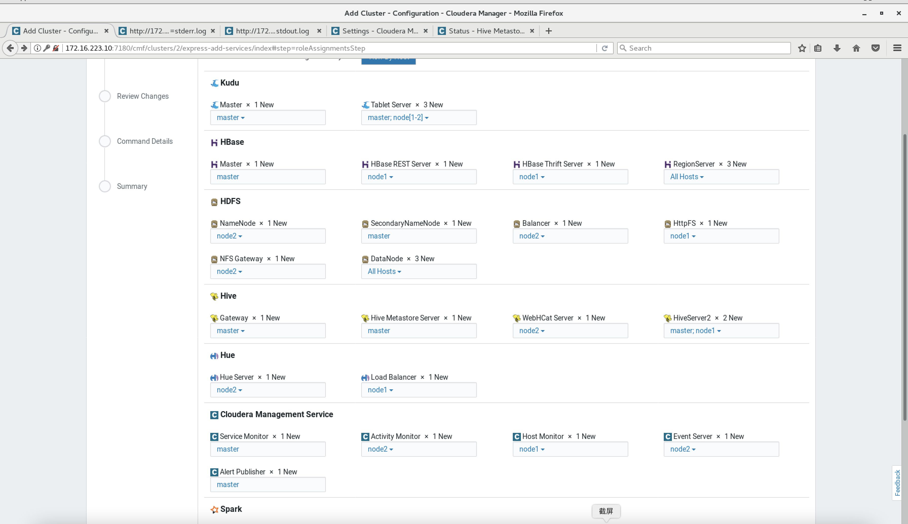
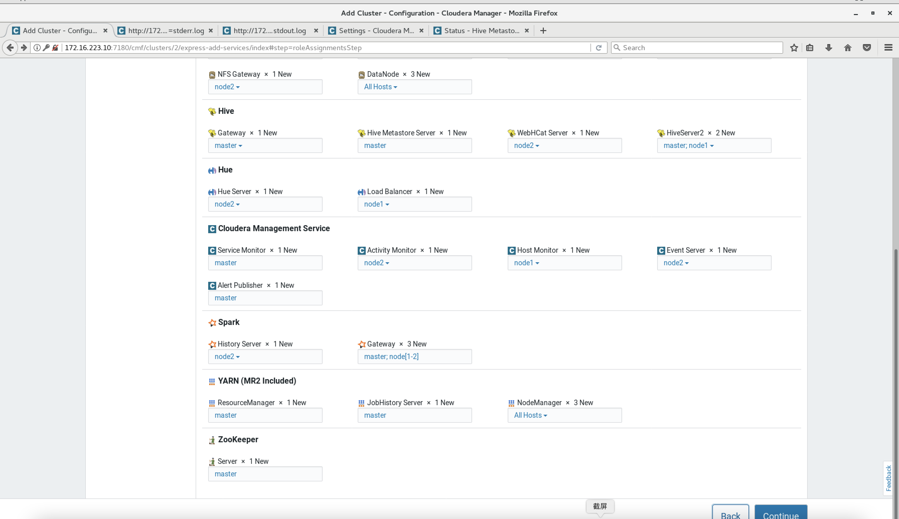

# CDH 6.2.X部署文档

## 目录

- [虚拟机安装](#vm)
    - [虚拟机软件](#vmware)
    - [虚拟机配置](#config)
    - [虚拟机配置静态网段](#ip)
    - [关闭防火墙](#firewall)
    - [关闭SELINUX](#selinux)
    - [设置时间](#timeZone)
- [虚拟机环境](#environment)
    - [yum安装](#yum)
    - [节点配置](#ipMap)
    - [免密登陆](#ssh)
    - [NTP时间同步设置](#ntp)
    - [Java](#java)
    - [Scala](#scala)
    - [MySQL](#mysql)
    - [JDBC驱动](#jdbc)
    - [修改系统设置](#sysConfig)
    - [本地搭建yum源](#httpd)
- [Cloudera Manager 安装](#cm)
    - [CM安装](#install)
    - [数据库配置](#dbConfig)
    - [下载CDH离线包](#cdh)
    - [启动CM服务](#startService)
- [集群部署](#deploy)
    - [集群创建](#cluster)
    - [服务和角色](#service)
- [其他优化](optimize)
    - [HDFS高可用](#ha)
    - [Hue关联Hbase](#hue)

---

Cloudera Manager官网安装指南
https://docs.cloudera.com/documentation/enterprise/6/6.2/topics/installation.html

需要安装包：
- 虚拟机镜像：CentOS-7-x86_64-DVD-1804.iso
- Java: jdk-8u301-linux-x64.rpm
- Scala: scala-2.11.6.rpm
- MySQL: mysql-5.7.29-1.el7.x86_64.rpm-bundle.tar
- CM: cm6.2.1-redhat7.tar.gz
- CDH: CDH-6.2.1-1.cdh6.2.1.p0.1425774-el7.parcel


# 虚拟机安装 <a id="vm"> </a>

### 虚拟机软件 <a id="vmware"> </a>
- Mac: VMware Fusion
- Windows: VMware Workstation Pro

### 虚拟机配置 <a id="config"> </a>
以三台虚拟机为例，一个主节点，两个从节点。

|服务器名称|CPU核数|Ram |硬盘 |
|--------|-------|----|----|
|master  |2      |12 G|80 G|
|node1   |2      |8 G |80 G|
|node2   |2      |8 G |80 G|

### 虚拟机配置静态网段 <a id="ip"> </a>
1. 打开配置文件
```shell
sudo vim /etc/sysconfig/network-scripts/ifcfg-ens33 
```

2. 修改配置文件
```text
# 修改
BOOTPROTO="static"
IPV6INIT="no"
# 新增
IPADDR=172.16.223.10
NETMASK=255.255.255.0
GATEWAY=172.16.223.1
DNS1=8.8.8.8
DNS2=114.114.114.114
# 删除
IPV6_AUTOCONF="yes"
IPV6_DEFROUTE="yes"
IPV6_PEERDNS="yes"
IPV6_PEERROUTES="yes"
IPV6_FAILURE_FATAL="no"
IPV6_ADDR_GEN_MODE="stable-privacy"
```
3. 重启网络
```shell
systemctl restart network
```

重启网络时 Failed to start LSB: Bring up/down networking，报错解决方法
```shell
systemctl stop NetworkManager
systemctl disable NetworkManager
```


### 关闭防火墙 <a id="firewall"> </a>
```shell
systemctl stop firewalld 
systemctl disable firewalld
```

### 关闭SELINUX <a id="selinux"> </a>
1. 打开配置文件
```shell
sudo vi /etc/selinux/config
```
2. 将SELINUX设置为
```txt
SELINUX=disabled
```
3.  设置临时生效或者重启
```shell
setenforce 0 # 临时生效
```
4. 检查状态
```shell
sestatus -v
# SELinux status: disabled 表示已经关闭了
```

### 设置时间 <a id="timeZone"> </a>
设置时区
```shell
timedatectl set-timezone Asia/Shanghai
```

# 虚拟机环境 <a id="environment"> </a>

### yum安装 <a id="yum"> </a>

```shell
sudo su

yum install -y vim          # 安装vim编辑器
yum -y install lrzsz        # 安装lrzsz文件传输工具
yum -y install wget         # 安装wget文件下载工具
yum -y install net-tools    # 安装netstat，查看端口监听状况
yum install -y unzip zip    # 下载unzip解压工具，解压命令
yum install openssh-clients
yum -y install perl.x86_64
yum -y install net-tools.x86_64
yum install ntp

exit
```

### 节点配置 <a id="ipMap"> </a>
配置IP和主机名的映射
```shell
sudo vim /etc/hosts
```
写入以下内容
```txt
172.16.223.10 master
172.16.223.11 node1
172.16.223.12 node2
```  


### 免密登陆 <a id="ssh"> </a>

1. 产生公钥和私钥：

```shell
ssh-keygen -t rsa   #（一直回车直即可）
```

2. 将公钥分发给所有节点（包括本机)：  

```shell
ssh-copy-id -i 用户@主机名
```

3. 测试ssh访问:  

```shell  
ssh 主机名
```

4. 权限

```shell
chmod 600 ~/.ssh/id_rsa
```

### NTP时间同步 <a id="ntp"> </a>
**参考**
- https://blog.csdn.net/qq_41910230/article/details/82314616
- https://docs.cloudera.com/documentation/enterprise/6/6.2/topics/install_cdh_enable_ntp.html#install_cdh_enable_ntp


**主节点 master**
1. 关闭chronyd
```shell
systemctl stop chronyd
systemctl disable chronyd
yum remove chrony
```
2. 打开ntp配置
```shell
sudo vi /etc/ntp.conf
```
3. 修改如下
```txt
# For more information about this file, see the man pages
# ntp.conf(5), ntp_acc(5), ntp_auth(5), ntp_clock(5), ntp_misc(5), ntp_mon(5).

driftfile /var/lib/ntp/drift

# Permit time synchronization with our time source, but do not
# permit the source to query or modify the service on this system.
restrict default nomodify notrap nopeer noquery

# Permit all access over the loopback interface.  This could
# be tightened as well, but to do so would effect some of
# the administrative functions.
restrict 127.0.0.1
restrict ::1

# Hosts on local network are less restricted.
restrict 172.16.223.10 mask 255.255.255.0 nomodify notrap

# Use public servers from the pool.ntp.org project.
# Please consider joining the pool (http://www.pool.ntp.org/join.html).
#server 0.centos.pool.ntp.org iburst
#server 1.centos.pool.ntp.org iburst
#server 2.centos.pool.ntp.org iburst
#server 3.centos.pool.ntp.org iburst
server 127.127.1.0

#broadcast 192.168.1.255 autokey        # broadcast server
#broadcastclient                        # broadcast client
#broadcast 224.0.1.1 autokey            # multicast server
#multicastclient 224.0.1.1              # multicast client
#manycastserver 239.255.254.254         # manycast server
#manycastclient 239.255.254.254 autokey # manycast client

# Enable public key cryptography.
#crypto

includefile /etc/ntp/crypto/pw

# Key file containing the keys and key identifiers used when operating
# with symmetric key cryptography.
keys /etc/ntp/keys

# Specify the key identifiers which are trusted.
#trustedkey 4 8 42

# Specify the key identifier to use with the ntpdc utility.
#requestkey 8

# Specify the key identifier to use with the ntpq utility.
#controlkey 8
# Enable writing of statistics records.
#statistics clockstats cryptostats loopstats peerstats

# Disable the monitoring facility to prevent amplification attacks using ntpdc
# monlist command when default restrict does not include the noquery flag. See
# CVE-2013-5211 for more details.
# Note: Monitoring will not be disabled with the limited restriction flag.
disable monitor
```

**从节点**
1. 关闭chronyd
```shell
systemctl stop chronyd
systemctl disable chronyd
yum remove chrony
```
2. 打开ntp配置
```shell
sudo vi /etc/ntp.conf
```
3. 修改如下
```txt
# For more information about this file, see the man pages
# ntp.conf(5), ntp_acc(5), ntp_auth(5), ntp_clock(5), ntp_misc(5), ntp_mon(5).

driftfile /var/lib/ntp/drift

# Permit time synchronization with our time source, but do not
# permit the source to query or modify the service on this system.
restrict default nomodify notrap nopeer noquery

# Permit all access over the loopback interface.  This could
# be tightened as well, but to do so would effect some of
# the administrative functions.
restrict 127.0.0.1
restrict ::1

# Hosts on local network are less restricted.
restrict 172.16.223.11 mask 255.255.255.0 nomodify notrap

# Use public servers from the pool.ntp.org project.
# Please consider joining the pool (http://www.pool.ntp.org/join.html).
#server 0.centos.pool.ntp.org iburst
#server 1.centos.pool.ntp.org iburst
#server 2.centos.pool.ntp.org iburst
#server 3.centos.pool.ntp.org iburst
server master

#broadcast 192.168.1.255 autokey        # broadcast server
#broadcastclient                        # broadcast client
#broadcast 224.0.1.1 autokey            # multicast server
#multicastclient 224.0.1.1              # multicast client
#manycastserver 239.255.254.254         # manycast server
#manycastclient 239.255.254.254 autokey # manycast client

# Enable public key cryptography.
#crypto

includefile /etc/ntp/crypto/pw

# Key file containing the keys and key identifiers used when operating
# with symmetric key cryptography.
keys /etc/ntp/keys

# Specify the key identifiers which are trusted.
#trustedkey 4 8 42
# Specify the key identifier to use with the ntpdc utility.
#requestkey 8

# Specify the key identifier to use with the ntpq utility.
#controlkey 8

# Enable writing of statistics records.
#statistics clockstats cryptostats loopstats peerstats

# Disable the monitoring facility to prevent amplification attacks using ntpdc
# monlist command when default restrict does not include the noquery flag. See
# CVE-2013-5211 for more details.
# Note: Monitoring will not be disabled with the limited restriction flag.
disable monitor
```
4. 与master节点同步
```shell
sudo ntpdate -u master
```
5. 自动生效
```shell
crontab -e
```
6. 插入以下内容，每次开启虚拟机都执行这个语句
```txt
0-59/1 * * * * /usr/sbin/ntpdate master
```


### Java <a id="java"> </a>
1. 本地上传安装包至虚拟机
```shell
scp /Users/zhijunliu/personal/mirror/jdk-8u301-linux-x64.rpm admin@172.16.223.10:/home/admin/Downloads
```
2. 虚拟机 rpm 安装
```shell
sudo mkdir /usr/java
sudo mv Downloads/jdk-8u301-linux-x64.rpm /usr/java/
cd /usr/java
sudo rpm -ivh  jdk-8u301-linux-x64.rpm
```
3. 配置环境变量
```shell
sudo vi /etc/profile
```
4. 在profile中加入以下内容
```txt
export JAVA_HOME=/usr/java/jdk1.8.0_301
export PATH=$PATH:$JAVA_HOME/bin:$JAVA_HOME/sbin
export CLASSPATH=.:$JAVA_HOME/lib/dt.jar:$JAVA_HOME/lib/tools.jar
```
5. 配置生效
```shell
source /etc/profile
```
6. 检查环境变量配置是否成功
```shell
java -version
```

### Scala <a id="scala"> </a>
1. 本地上传安装包至虚拟机
```shell
scp /Users/zhijunliu/personal/mirror/scala-2.11.6.rpm admin@172.16.223.12:/home/admin/Downloads
```
2. 虚拟机 rpm 安装
```shell
sudo mkdir /usr/scala
sudo mv /home/admin/Downloads/scala-2.11.6.rpm /usr/scala/
cd /usr/scala
sudo rpm -ivh scala-2.11.6.rpm
```
3. 配置环境变量
```shell
sudo vi /etc/profile
```
4. 在profile中加入以下内容
```txt
SCALA_HOME=/usr/scala/scala-2.11.6
SCALA_PATH=$PATH:$SCALA_HOME/bin
export SCALA_HOME SCALA_PATH
```
5. 配置生效
```shell
source /etc/profile
```
6. 检查环境变量配置是否成功
```shell
scala -version
```

### MySQL <a id="mysql"> </a>
1. 主节点master安装即可，本地上传安装包到master节点
```shell
scp /Users/zhijunliu/personal/mirror/mysql-5.7.29-1.el7.x86_64.rpm-bundle.tar admin@172.16.223.10:/home/admin/Downloads
```
2. 删除mariadb相关库，两种方式
```shell
rpm -qa | grep maria
rpm -e mariadb-libs-5.5.56-2.el7.x86_64 –nodeps
```
```shell
yum remove mariadb-libs-5.5.56-2.el7.x86_64
```
3. 安装
```shell
sudo su
mkdir /usr/mysql
mv /home/admin/Downloads/mysql-5.7.29-1.el7.x86_64.rpm-bundle.tar /usr/mysql/
cd /usr/mysql
tar -xvf mysql-5.7.29-1.el7.x86_64.rpm-bundle.tar

rpm -ivh mysql-community-common-5.7.29-1.el7.x86_64.rpm
rpm -ivh mysql-community-libs-5.7.29-1.el7.x86_64.rpm
rpm -ivh mysql-community-libs-compat-5.7.29-1.el7.x86_64.rpm
rpm -ivh mysql-community-client-5.7.29-1.el7.x86_64.rpm
rpm -ivh mysql-community-server-5.7.29-1.el7.x86_64.rpm
```
4. 修改配置文件
```shell
vi /etc/my.cnf
```
5. 在```my.cnf```中写入以下内容
```txt
[mysqld]
datadir=/var/lib/mysql
socket=/var/lib/mysql/mysql.sock
symbolic-links=0
log-error=/var/log/mysqld.log
pid-file=/var/run/mysqld/mysqld.pid

# 以下是新增设置-编码设置
character-set-client-handshake = FALSE
character-set-server = utf8mb4
collation-server = utf8mb4_unicode_ci
init_connect='SET NAMES utf8mb4'

# 以下为cloudera 推荐设置
transaction-isolation = READ-COMMITTED
key_buffer_size = 32M
max_allowed_packet = 16M
thread_stack = 256K
thread_cache_size = 64
query_cache_limit = 8M
query_cache_size = 64M
query_cache_type = 1
max_connections = 550
#expire_logs_days = 10
#max_binlog_size = 100M
log_bin=/var/lib/mysql/mysql_binary_log
server_id=1
binlog_format = mixed
read_buffer_size = 2M
read_rnd_buffer_size = 16M
sort_buffer_size = 8M
join_buffer_size = 8M
# InnoDB settings
innodb_file_per_table = 1
innodb_flush_log_at_trx_commit  = 2
innodb_log_buffer_size = 64M
innodb_buffer_pool_size = 4G
innodb_thread_concurrency = 8
innodb_flush_method = O_DIRECT
innodb_log_file_size = 512M

[mysqld_safe]
log-error=/var/log/mysqld.log
pid-file=/var/run/mysqld/mysqld.pid
sql_mode=STRICT_ALL_TABLES
# 以上是 cloudera 推荐设置

# 编码设置,default-character-set报错就将以下注释掉
[client]
default-character-set = utf8mb4
[mysql]
default-character-set = utf8mb4
```
6. 启动mysql，并查看临密码
```shell
systemctl start mysqld
grep 'temporary password' /var/log/mysqld.log
```
7. 用临时密码登陆mysql
```shell
mysql -u root -p  # 临时密码 例如 9q%AHBef,>4y
```
8. mysql中重新设置密码等级和登陆密码
```sql
SET GLOBAL validate_password_policy=LOW;     //只需要8位
SET PASSWORD FOR 'root'@'localhost' = PASSWORD('12345678');
// SET GLOBAL validate_password_policy=0;       //只验证长度
quit;
```
9. 运行mysql初始化设置脚本（根据提示删除匿名用户和测试库，并允许远程登录）
```shell
/usr/bin/mysql_secure_installation
```
9. 登陆mysql
```shell
mysql -u root -p
```
10. 设置远程登陆权限
```sql
select HOST,USER,Grant_priv,Super_priv from mysql.`user`;
update mysql.user set Grant_priv='Y',Super_priv='Y',host = '%' where user = 'root';
flush privileges;
```

11. 验证编码

```sql
SHOW VARIABLES like '%char%';
```
需要和表格里内容一致
|||
|-----|---|
|character_set_client	| utf8mb4|
|character_set_connection|	utf8mb4|
|character_set_database|	utf8mb4|
|character_set_filesystem|	binary|
|character_set_results	|utf8mb4|
|character_set_server	|utf8mb4|
|character_set_system	|utf8|
|character_sets_dir|	/usr/share/mysql/charsets/|
|validate_password_special_char_count	|1|


12. 退出mysql，mysql自启设置

```shell
systemctl enable mysqld
```


### JDBC驱动 <a id="jdbc"> </a>
在所有节点安装 mysql-connector-java
```shell
sudo su 
mkdir /usr/mysql
cd /usr/mysql
wget https://dev.mysql.com/get/Downloads/Connector-J/mysql-connector-java-5.1.32.tar.gz

tar  -zxvf  mysql-connector-java-5.1.32.tar.gz
mkdir -p /usr/share/java/
cp mysql-connector-java-5.1.32/mysql-connector-java-5.1.32-bin.jar /usr/share/java/mysql-connector-java.jar 
# 这需要改名(必须)
# 版本 5.1.32，需要在5.1.26即以上，太高版本有时候后续有问题

cd /usr/share/java/
chmod 777 mysql-connector-java.jar
```

### 修改系统设置 <a id="sysConfig"> </a>
**所有节点**
1. 修改Linux内核参数
```shell
sudo su

cat /proc/sys/vm/swappiness
echo "10" > /proc/sys/vm/swappiness #关闭大页面压缩

cat /sys/kernel/mm/transparent_hugepage/defrag
echo never > /sys/kernel/mm/transparent_hugepage/defrag #关闭THG
echo never > /sys/kernel/mm/transparent_hugepage/enabled
```
2. 修改linux文件最大打开数
```shell
vi /etc/security/limits.conf
```
3. 添加以下内容
```txt
# End of file
* soft nofile 1000000
* hard nofile 1000000
```
4. 系统运行最大进程数量修改
```shell
vi /etc/security/limits.d/20-nproc.conf
```
5. 修改以下内容
```text
*          soft    nproc     409600
root       soft    nproc     unlimited
```
6. Cloudera建议将交换空间设置为0，过多的交换空间会引起GC耗时的激增
```shell
echo "vm.swappiness = 0" >> /etc/sysctl.conf
exit
```

### 搭建本地 yum 源  <a id="httpd"> </a>
仅对主节点 master
```shell
sudo yum install httpd -y
sudo systemctl  start httpd
sudo systemctl enable httpd
```

# Cloudera Manager 安装 <a id="cm"> </a>
**安装包下载地址**
https://blog.csdn.net/zhumingye/article/details/115181682?utm_source=app&app_version=4.11.0#_____2
### CM安装 <a id="install"> </a>
1. 本地上传安装包至每台虚拟机
```shell
scp /Users/zhijunliu/personal/mirror/cm6.2.1/cm6.2.1-redhat7.tar.gz  admin@172.16.223.10:/home/admin/Downloads
```
2. 解压至对应路径（http://localhost/cloudera-repos/cm6）
```shell
sudo su

mkdir -p /var/www/html/cloudera-repos/cm6
tar xvfz cm6.2.1-redhat7.tar.gz -C /var/www/html/cloudera-repos/cm6 --strip-components=1
# http://localhost/cloudera-repos/cm6
```
3. 打开 cloudera-repo 配置
```shell
vim /etc/yum.repos.d/cloudera-repo.repo 
```
4. 修改ip后，写入以下内容
```txt
[cloudera-repo] 
name=cloudera-repo 
baseurl=http://172.16.223.10/cloudera-repos/cm6
enabled=1 
gpgcheck=0 
```

5. rpm安装
```shell
cd /var/www/html/cloudera-repos/cm6/RPMS/x86_64

# 主节点master
sudo rpm -ivh cloudera-manager-daemons-6.2.1-1426065.el7.x86_64.rpm
sudo rpm -ivh cloudera-manager-agent-6.2.1-1426065.el7.x86_64.rpm
sudo rpm -ivh cloudera-manager-server-6.2.1-1426065.el7.x86_64.rpm

# 从节点 node 1-2
sudo rpm -ivh cloudera-manager-daemons-6.2.1-1426065.el7.x86_64.rpm
sudo rpm -ivh cloudera-manager-agent-6.2.1-1426065.el7.x86_64.rpm
```
6. 安装第五部报错时需要的包，需要自定义
```shell
yum install /lib/lsb/init-functions mod_ssl openssl-devel python-psycopg2 MySQL-python postgresql-libs.x86_64
```
7. 打开配置文件
```shell
vim /etc/cloudera-scm-agent/config.ini
```
8. 修改配置
```txt
server_host=master #cloudera-scm-server节点名称
```
9. 退出root用户
```shell
exit
```

### 数据库配置 <a id="dbConfig"> </a>
1. 登陆mysql，创建以下数据库和用户
```sql
GRANT ALL ON scm.* TO 'scm'@'%' IDENTIFIED BY '12345678';

CREATE DATABASE amon DEFAULT CHARACTER SET utf8 DEFAULT COLLATE utf8_general_ci;
GRANT ALL ON amon.* TO 'amon'@'%' IDENTIFIED BY '12345678';

CREATE DATABASE rman DEFAULT CHARACTER SET utf8 DEFAULT COLLATE utf8_general_ci;
GRANT ALL ON rman.* TO 'rman'@'%' IDENTIFIED BY '12345678';

CREATE DATABASE hue DEFAULT CHARACTER SET utf8 DEFAULT COLLATE utf8_general_ci;
GRANT ALL ON hue.* TO 'hue'@'%' IDENTIFIED BY '12345678';

CREATE DATABASE metastore DEFAULT CHARACTER SET utf8 DEFAULT COLLATE utf8_general_ci;
GRANT ALL ON metastore.* TO 'hive'@'%' IDENTIFIED BY '12345678';

CREATE DATABASE sentry DEFAULT CHARACTER SET utf8 DEFAULT COLLATE utf8_general_ci;
GRANT ALL ON sentry.* TO 'sentry'@'%' IDENTIFIED BY '12345678';

CREATE DATABASE nav DEFAULT CHARACTER SET utf8 DEFAULT COLLATE utf8_general_ci;
GRANT ALL ON nav.* TO 'nav'@'%' IDENTIFIED BY '12345678';

CREATE DATABASE navms DEFAULT CHARACTER SET utf8 DEFAULT COLLATE utf8_general_ci;
GRANT ALL ON navms.* TO 'navms'@'%' IDENTIFIED BY '12345678';

CREATE DATABASE oozie DEFAULT CHARACTER SET utf8 DEFAULT COLLATE utf8_general_ci;
GRANT ALL ON oozie.* TO 'oozie'@'%' IDENTIFIED BY '12345678';

# 检查是否创建完成
SHOW DATABASES;
```
2. 如果有数据库scm，就删除
```sql
DROP DATABASE scm;
```
3. 退出mysql
4. 在shell建立数据库 scm
```shell
sudo /opt/cloudera/cm/schema/scm_prepare_database.sh mysql -h master -P3306 -uroot -p12345678 --scm-host master scm scm 12345678
```
### 下载CDH离线包 <a id="cdh"> </a>
1. 上传cdh parcel 至 运行CM server的节点，即master节点
```shell
scp /Users/zhijunliu/personal/mirror/cdh6.2.1/CDH-6.2.1-1.cdh6.2.1.p0.1425774-el7.parcel admin@172.16.223.10:/home/admin/Downloads
```
2. 生成sha1签名文件
```shell
sudo su
mkdir -p /opt/cloudera/parcel-repo
sudo mv CDH-6.2.1-1.cdh6.2.1.p0.1425774-el7.parcel /opt/cloudera/parcel-repo/
cd /opt/cloudera/parcel-repo
sha1sum CDH-6.2.1-1.cdh6.2.1.p0.1425774-el7.parcel | awk '{ print $1 }' > CDH-6.2.1-1.cdh6.2.1.p0.1425774-el7.parcel.sha
exit
```
3. 创建用户cloudera-scm（所有节点）
```shell
useradd --system --home=/opt/cm-5.15.0/run/cloudera-scm-server/ --no-create-home --shell=/bin/false --comment "Cloudera SCM User" cloudera-scm
```
4. 修改目录所属用户
```shell
cd /opt/cloudera/parcel-repo
sudo chown -R cloudera-scm:cloudera-scm /opt/cloudera/parcel-repo/*
```
### 启动CM服务 <a id="startService"> </a>
```shell
# 开机自启
sudo systemctl start cloudera-scm-server（server节点）
sudo systemctl enable cloudera-scm-server（server节点）
sudo systemctl start cloudera-scm-agent（所有agent节点，此处包含server节点）
sudo systemctl enable cloudera-scm-agent（所有agent节点，此处包含server节点）
# 监控server 的运行日志
sudo tail -f /var/log/cloudera-scm-server/cloudera-scm-server.log
# 监控agent的运行日志
sudo tail -f /var/log/cloudera-scm-agent/cloudera-scm-agent.log
```

# 集群部署 <a id="deploy"> </a>

### 集群创建 <a id="cluster"> </a>
从server节点登陆CM: http://172.16.223.10:7180/cmf/login

默认用户名：```admin```

默认密码：```admin```

一些用到的url:
- http://172.16.223.10/cloudera-repos/cm6 
- jdbc:mysql://172.16.223.10:3306/metastore?createDatabaseIfNotExist=true

### 服务和角色 <a id="service"> </a>






# 其他优化 <a id="optimize"> </a>

### HDFS高可用 <a id="ha"> </a>
https://blog.csdn.net/weixin_40803329/article/details/80800840

### Hue关联Hbase <a id="hue"> </a>
- CM 5.14.X
https://www.cnblogs.com/qqflying/p/10955771.html
- CM 6.2.X
    - 在 CM 5.14.X的基础上，修改配置```Hue Service Advanced Configuration Snippet (Safety Valve) for hue_safety_valve.ini```
    - 第1、2、6步：https://docs.cloudera.com/documentation/enterprise/6/6.2/topics/admin_hue_enable_apps.html
