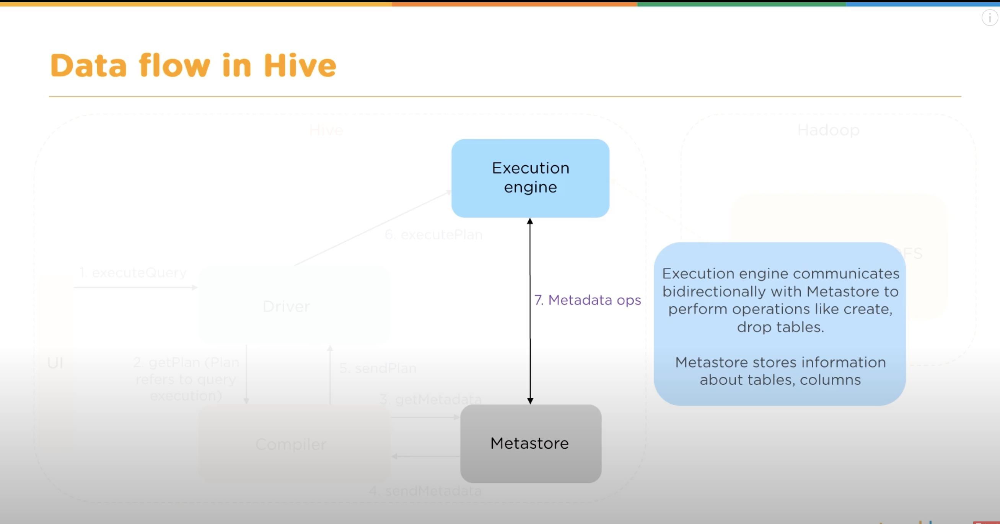

# Hive on Cloudera Hadoop System

**Tutorial**

- https://www.youtube.com/watch?v=rr17cbPGWGA&t=684s
- https://hive.apache.org/
- http://hortonworks.com/wp-content/uploads/2016/05/Hortonworks.CheatSheet.SQLtoHive.pdf


### Hive Architecture


### Data Flow in Hive




### Hive Data Modeling


### Hive Data Types

- Primitive Data Type
    - Numeric Data Type: integral, float, decimal
    - String Data Type: string, char
    - Date/Time Data Type: timestamp, date, interval
    - Miscellaneous Data Type: boolean, binary
- Complex Data Type
    - Arrays: ```array<data_type>``` collection of same entities
    - Maps: ```map<primitive_type, data_type>``` collection of key value pairs
    - Structs: collection of complex data types with comment
    - Units: a collection of heterogeneous data types

### Different Modes of Hive

**Local Mode**

- singe data node, do some fast query on small dataset
- uses mysql, jdbc instead

**MapReduce Mode**

- multiple data nodes
- large dataset


### Difference Between Hive and RDBMS


### Demo on HiveQL

建表，默认separator是TAB，上传本地数据

```
CREATE TABLE employee
(id INT, name STRING, dept STRING, yoj INT, salary INT)
ROW FORMAT DELIMITED FIELDS TERMINATED BY ','
TBLPROPERTIES ("skip.header.line.count"="1");

LOAD DATA LOCAL INPATH 
'path' 
INTO TABLE employee;
```

### Hive Partition

select on par

- Create table with partition

```
CREATE TABLE emp_details_partitioned
(
    emp_name STRING,
    unit STRING,
    exp INT
)
PARTITIONED BY (location STRING);
```

- Load data with static partition

```
INSERT OVERWRITE TABLE emp_details_partitioned
PARTITION(location="BBSR")
SELECT emp_name, unit, exp FROM emp_details
WHERE location="BBSR";
```

- Load data with dynamic partition

```
set hive.exec.dynamic.partition=true;
set hive.exec.dynamic.partition.mode=nonstrict;

INSERT OVERWRITE TABLE emp_details_partitioned
PARTITION (location)
SELECT * FROM emp_details;
```

```
LOAD DATA [LOCAL] INPATH 'filepath' [OVERWRITE] INTO TABLE tablename [PARTITION (partcol1=val1,partcol2=val2 ...)]
```

- drop partition

```
ALTER TABLE table_name DROP PARTITION(partition_name="partition_value")
```


### Hive Bucket

The concept of bucketing is based on the hashing techniques

```
set hive.enforce.bucketing=true;

CREATE TABLE table_bucket(id INT, name STRING, salary FLOAT)
CLUSTERED BY (id) INTO 3 BUCKETS
ROW FORMAT DELIMITED
FIELDS TERMINATED BY ',';

INSERT OVERWRITE TABLE table_bucket SELECT * FROM table;

```

### Managed Table and External Table

- A managed table can be created using ```CREATE TABLE TABLENAME``` statement
    - when you drop a managed table, the data and meta data will be removed
- An external table can be created using ```CREATE EXTERNAL TABLE TABLENAME``` statement
    - when you drop an external table, only the meta data will be deleted, and the underlying hdfs directory will remain intact


```
CREATE TABLE employee_managed(
    employeeId INT,
    employeeName STRING,
    employeeSalary STRING
)
ROW FORMAT DELIMITED
FIELDS TERMINATED BY '\t'
STORED AS TEXTFILE;


CREATE EXTERNAL TABLE employee_external(
    employeeId INT,
    employeeName STRING,
    employeeSalary STRING
)
ROW FROMAT DELIMITED
FIELDS TERMINATED BY '\t'
STORED AS TEXTFILE
LOCATION '/user/mat/employee_external'; ## 不写location有默认路径
# since "hive.metastore.warehouse.dir" is set to "/user/hive/warehouse" HDFS directory, the hive data will be stored in this 
```


### Hive 表刷新分区

### Hive 小文件合并

bucketing 和小文件什么关系？？


---

# Hive interaction with Scala & Spark


---

CLI command line interface

----

# Hive 优化


