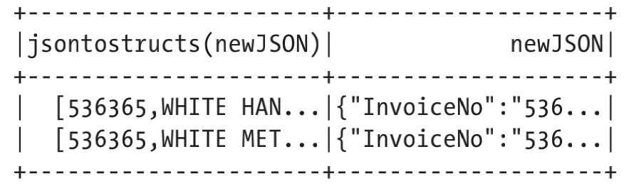
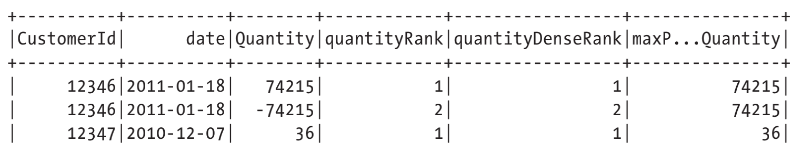
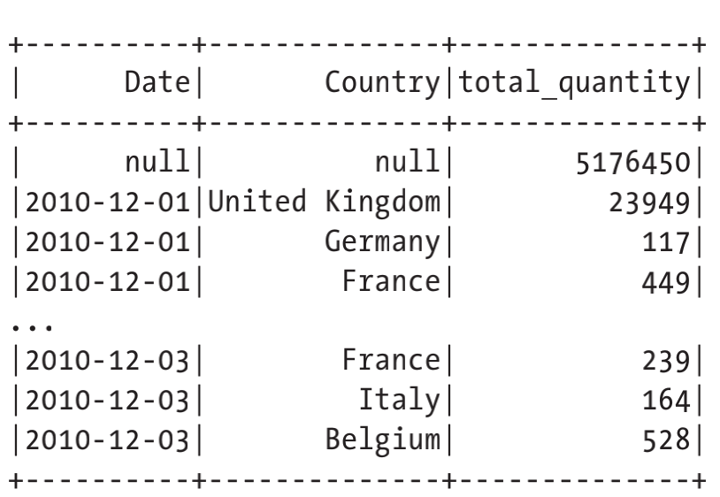
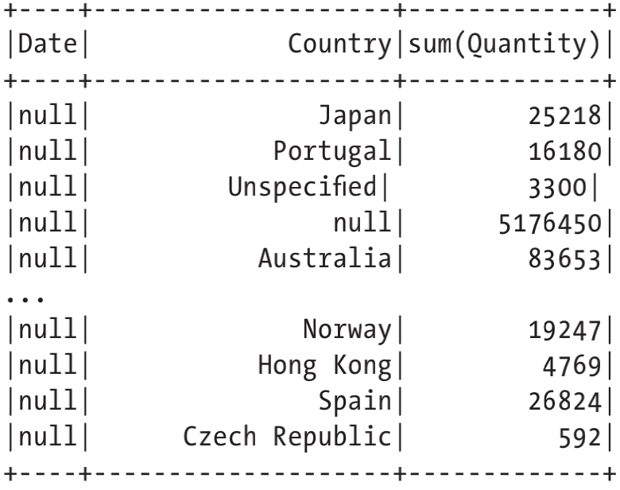
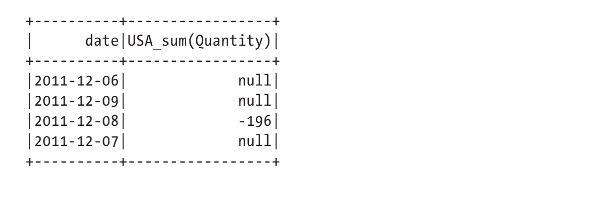
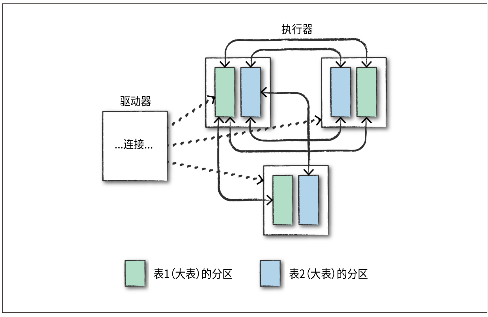
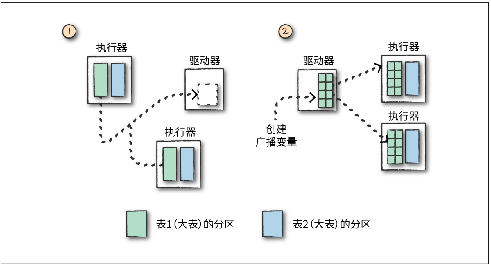

# Spark


## 第二章 Spark浅析

**宽窄依赖**

- 窄依赖：输入分区和输出分区一一对应
- 宽依赖：shuffle操作，一对多映射

**惰性评估**

- 等到绝对需要时才执行计算
- Spark首先会将这个计划编译为可以在集群中高效运行的流水线式的物理执行计划，然后等待，直到最后时刻才开始执行代码，优化物理执行计划。
- 惰性转换的DAG图优化物理执行计划


## 第三章 Spark工具集介绍

**运行生产应用程序**

- spark-submit + YARN/Mesos/Standalone + jar包
    ```
    ./bin/spark-submit \
    --class org.apache.spark.examples.SparkPi \
    --master local \
    ./examples/jars/spark-examples_2.11-2.2.0.jar 10
    ```

**Dataset 类型安全的结构化API**

**结构化流处理**

```shell
val streamingDataFrame = spark.readStream
.schema(staticSchema)
.option("maxFilesPerTrigger", 1)
.format("csv")
.option("header", "true")
.load("/data/retail-data/by-day/*.csv")
```

**机器学习和高级数据分析**


**低级API**

**Spark R**

**Spark的生态系统和工具包**

## 第四章 结构化API概述

- 用户代码
- 解析后的逻辑计划
- catalyst优化后的逻辑计划
- spark开始执行u里计划流程，通过代价模型比较分析
- 集群上执行

## 第五章 基本的结构化操作

**创建DataFrame**

```scala
// 读文件
val df = spark.read.format("json")
    .load("/data/flight-data/json/2015-summary.json")
df.createOrReplaceTempView("dfTable")
// RowEncoder or createDataFrame
import org.apache.spark.sql.Row
import org.apache.spark.sql.types.{StructField, StructType, StringType, LongType}
val myManualSchema = new StructType(Array(
    new StructField("some", StringType, true),
    new StructField("col", StringType, true),
    new StructField("names", LongType, false)))
val myRows = Seq(Row("Hello", null, 1L))
val myRDD = spark.sparkContext.parallelize(myRows)
val myDf = spark.createDataFrame(myRDD, myManualSchema)
myDf.show()
// toDF
val myDF = Seq(("Hello", 2, 1L)).toDF("col1", "col2", "col3")
```

**select函数**

```scala
// in Scala
df.select("DEST_COUNTRY_NAME", "ORIGIN_COUNTRY_NAME").show(2)

df.select(expr("DEST_COUNTRY_NAME AS destination")).show(2)
df.select(expr("DEST_COUNTRY_NAME as destination").alias("DEST_COUNTRY_NAME"))
 .show(2)
```

```sql
-- in SQL
SELECT DEST_COUNTRY_NAME, ORIGIN_COUNTRY_NAME FROM dfTable LIMIT 2

SELECT DEST_COUNTRY_NAME as destination FROM dfTable LIMIT 2
```

**selectExpr**

```scala
df.selectExpr(
    "*", 
    "(DEST_COUNTRY_NAME = ORIGIN_COUNTRY_NAME) as withinCountry")
    .show(2)

df.selectExpr("avg(count)", "count(distinct(DEST_COUNTRY_NAME))").show(2)
```

```sql
SELECT *, (DEST_COUNTRY_NAME = ORIGIN_COUNTRY_NAME) as withinCountry
FROM dfTable
LIMIT 2

SELECT avg(count), count(distinct(DEST_COUNTRY_NAME)) FROM dfTable LIMIT 2
```

**添加列**

```scala
df.withColumn("numberOne", lit(1)).show(2)
df.withColumn("withinCountry", expr("ORIGIN_COUNTRY_NAME == DEST_COUNTRY_NAME"))
    .show(2)
```

```sql
SELECT *, 1 as numberOne FROM dfTable LIMIT 2
```

**重命名列**

```scala
df.withColumnRenamed("DEST_COUNTRY_NAME", "dest").columns
```

**删除列**

```scala
df.drop("ORIGIN_COUNTRY_NAME", "DEST_COUNTRY_NAME")
```

**更改列的类型**

```scala
df.withColumn("count2", col("count").cast("long"))
```
```sql
SELECT *, cast(count as long) AS count2 FROM dfTable
```

**过滤行**

```scala
df.filter(col("count") < 2).show(2)
df.where("count < 2").show(2)

df.where(col("count") < 2).where(col("ORIGIN_COUNTRY_NAME") =!= "Croatia")
 .show(2)
```
```sql
SELECT * FROM dfTable WHERE count < 2 LIMIT 2

SELECT * FROM dfTable WHERE count < 2 AND ORIGIN_COUNTRY_NAME != "Croatia"
LIMIT 2
```

**获得去重后的行**

```scala
df.select("ORIGIN_COUNTRY_NAME", "DEST_COUNTRY_NAME").distinct().count()
```

```sql
SELECT COUNT(DISTINCT(ORIGIN_COUNTRY_NAME, DEST_COUNTRY_NAME)) FROM dfTable
```


**区分大小写**

spark默认不区分大小写
```sql
set spark.sql.caseSensitive true
```

**随机抽样**

```scala
val seed = 5
val withReplacement = false
val fraction = 0.5
df.sample(withReplacement, fraction, seed).count()
```

**随机分割**

多用与机器学习，切分训练集、测试集
```scala
val dataFrames = df.randomSplit(Array(0.25, 0.75), seed)
dataFrames(0).count() > dataFrames(1).count() // 结果为False
```

**连接和追加行（联合操作）**

```scala
import org.apache.spark.sql.Row
val schema = df.schema
val newRows = Seq(
    Row("New Country", "Other Country", 5L),
    Row("New Country 2", "Other Country 3", 1L)
)
val parallelizedRows = spark.sparkContext.parallelize(newRows)
val newDF = spark.createDataFrame(parallelizedRows, schema)
df.union(newDF)
    .where("count = 1")
    .where($"ORIGIN_COUNTRY_NAME" =!= "United States")
    .show()
```

**行排序**

```scala
df.sort("count").show(5)
df.orderBy("count", "DEST_COUNTRY_NAME").show(5)
df.orderBy(col("count"), col("DEST_COUNTRY_NAME")).show(5)

import org.apache.spark.sql.functions.{desc, asc}
df.orderBy(expr("count desc")).show(2)
df.orderBy(desc("count"), asc("DEST_COUNTRY_NAME")).show(2)

// sort each partition before other operation
spark.read.format("json").load("/data/flight-data/json/*-summary.json")
    .sortWithinPartitions("count")
```

**LIMIT**

```scala
df.limit(5).show()
```

**重新划分和合并**

```scala
df.rdd.getNumPartitions
df.repartition(5)
// 按常用列进行重新分区
df.repartition(col("DEST_COUNTRY_NAME"))
df.repartition(5, col("DEST_COUNTRY_NAME"))
// 合并（没有导致数据全面洗牌）
df.repartition(5, col("DEST_COUNTRY_NAME")).coalesce(2)
```

**驱动器获取行**

```scala
collectDF.take(5) // 获取整数行
collectDF.show() // 更友好的打印
collectDF.show(5, false)
collectDF.collect()
collectDF.toLocalIterator()
```

## 第六章 处理不同数据类型

**处理布尔类型**

过滤器，Spark SQL使用过滤器不会使性能下降

```scala
import org.apache.spark.sql.functions.col
df.where(col("InvoiceNo") === 536365).select("InvoiceNo", "Description")
    .show(5, false)

// 谓词表达式
df.where("InvoiceNo = 536365").show(5, false)

// and & or
val priceFilter = col("UnitPrice") > 600
val descripFilter = col("Description").contains("POSTAGE")
df.where(col("StockCode").isin("DOT")).where(priceFilter.or(descripFilter))
    .show()

// 删掉一个指定boolean类型的列
val DOTCodeFilter = col("StockCode") === "DOT"
val priceFilter = col("UnitPrice") > 600
val descripFilter = col("Description").contains("POSTAGE")
df.withColumn("isExpensive", DOTCodeFilter.and(priceFilter.or(descripFilter)))
    .where("isExpensive")
    .select("unitPrice", "isExpensive").show(5)

import org.apache.spark.sql.functions.{expr, not, col}
df.withColumn("isExpensive", not(col("UnitPrice").leq(250)))
    .filter("isExpensive")
    .select("Description", "UnitPrice").show(5)
df.withColumn("isExpensive", expr("NOT UnitPrice <= 250"))
    .filter("isExpensive")
    .select("Description", "UnitPrice").show(5)

// 安全等价测试
df.where(col("Description").eqNullSafe("hello")).show()
```

**处理数值类型**

```scala
// (x+y)^2 + 5
import org.apache.spark.sql.functions.{expr， pow}
val fabricatedQuantity = pow(col("Quantity") * col("UnitPrice")， 2) + 5
df.select(expr("CustomerId")， fabricatedQuantity.alias("realQuantity")).show(2)

// 2.5 round-向上取整-3; bround-向下取整-2
import org.apache.spark.sql.functions.{round， bround}
import org.apache.spark.sql.functions.lit
df.select(round(col("UnitPrice")， 1).alias("rounded")， col("UnitPrice")).show(5)
df.select(round(lit("2.5")), bround(lit("2.5"))).show(2)

// Pearson's 相关系数
import org.apache.spark.sql.functions.{corr}
df.stat.corr("Quantity", "UnitPrice")
df.select(corr("Quantity", "UnitPrice")).show()

// summarize count, mean, std, min, max
df.describe().show()

// 中位数
import org.apache.spark.sql.functions.{count， mean， stddev_pop， min， max}
val colName = "UnitPrice"
val quantileProbs = Array(0.5)
val relError = 0.05
df.stat.approxQuantile("UnitPrice"， quantileProbs， relError) // 2.51

// 交叉列表（输出会很大）
df.stat.crosstab("StockCode"， "Quantity").show()

// 频繁项对
df.stat.freqItems(Seq("StockCode"， "Quantity")).show()

// 为每行生成一个ID
import org.apache.spark.sql.functions.monotonically_increasing_i
df.select(monotonically_increasing_id()).show(2)
```

**处理字符串类型**

```scala
// 单词首字母大写
import org.apache.spark.sql.functions.{initcap}
df.select(initcap(col("Description"))).show(2, false)

// 大小写转换
import org.apache.spark.sql.functions.{lower, upper}
df.select(col("Description"),
    lower(col("Description")),
    upper(lower(col("Description")))).show(2)

// trim and pad. 注意，如果lpad或rpad方法输入的数值参数小于字符串长度，它将从字符串的右侧删除字符。
import org.apache.spark.sql.functions.{lit, ltrim, rtrim, rpad, lpad, trim}
df.select(
    ltrim(lit(" HELLO ")).as("ltrim"),
    rtrim(lit(" HELLO ")).as("rtrim"),
    trim(lit(" HELLO ")).as("trim"),
    lpad(lit("HELLO"), 3, " ").as("lp"),
    rpad(lit("HELLO"), 10, " ").as("rp")).show(2)
// ltrim-"HELLO    "; rtrim-"    HELLO"; trim-"HELLO"; lp-" HE"; rp-"HELLO      "

// 正则表达式 replace
import org.apache.spark.sql.functions.regexp_replace
val simpleColors = Seq("black", "white", "red", "green", "blue")
val regexString = simpleColors.map(_.toUpperCase).mkString("|") // 或
df.select(
    regexp_replace(col("Description"), regexString, "COLOR").alias("color_clean"),
    col("Description")).show(2)

// 取出被提到的第一个颜色
import org.apache.spark.sql.functions.regexp_extract
val regexString = simpleColors.map(_.toUpperCase).mkString("(", "|", ")")
df.select(
    regexp_extract(col("Description"), regexString, 1).alias("color_clean"),
    col("Description")).show(2)

// contains black or white (python/sql - instr)
val containsBlack = col("Description").contains("BLACK")
val containsWhite = col("DESCRIPTION").contains("WHITE")
df.withColumn("hasSimpleColor", containsBlack.or(containsWhite))
    .where("hasSimpleColor")
    .select("Description").show(3, false)

// 是否包含多种颜色时
val simpleColors = Seq("black", "white", "red", "green", "blue")
val selectedColumns = simpleColors.map(color => {
        col("Description").contains(color.toUpperCase).alias(s"is_$color")
    }):+expr("*") // could also append this value
df.select(selectedColumns:_*).where(col("is_white").or(col("is_red")))
 .select("Description").show(3, false)
```

**处理日期和时间戳类型**

```scala
// 当前日期和当前时间戳
import org.apache.spark.sql.functions.{current_date, current_timestamp}
val dateDF = spark.range(10)
    .withColumn("today", current_date())
    .withColumn("now", current_timestamp())
dateDF.createOrReplaceTempView("dateTable")

// 日期加减天数
import org.apache.spark.sql.functions.{date_add, date_sub}
dateDF.select(date_sub(col("today"), 5), date_add(col("today"), 5)).show(1)

// 两个日期之间相隔的天数和月数
import org.apache.spark.sql.functions.{datediff, months_between, to_date}
dateDF.withColumn("week_ago", date_sub(col("today"), 7))
    .select(datediff(col("week_ago"), col("today"))).show(1)
dateDF.select(
    to_date(lit("2016-01-01")).alias("start"),
    to_date(lit("2017-05-22")).alias("end"))
    .select(months_between(col("start"), col("end"))).show(1)

// to_date 解析 年-月-日
dateDF.select(to_date(lit("2016-20-12"))，to_date(lit("2017-12-11"))).show(1) // null, 2017-12-11

// 指定日期格式
val dateFormat = "yyyy-dd-MM"
val cleanDateDF = spark.range(1).select(
    to_date(lit("2017-12-11"), dateFormat).alias("date"),
    to_date(lit("2017-20-12"), dateFormat).alias("date2"))
cleanDateDF.createOrReplaceTempView("dateTable2")
import org.apache.spark.sql.functions.to_timestamp
cleanDateDF.select(to_timestamp(col("date”), dateFormat)).show() //2017-11-12 00:00:00

// filter
cleanDateDF.filter(col("date2") > lit("2017-12-12")).show()
cleanDateDF.filter(col("date2") > "'2017-12-12'").show() // 字符串 -> spark解析成文本
```

**处理数据中的空值**

```scala
// 合并，返回第一个非空值
import org.apache.spark.sql.functions.coalesce
df.select(coalesce(col("Description")， col("CustomerId"))).show()

// drop 若指定“any”作为参数，当存在一个值是null时，就删除改行；若指定“all”为参数，只有当所有的值为null或者NaN时才能删除该行：
df.na.drop("all"， Seq("StockCode"， "InvoiceNo")) 

// fill
df.na.fill(5， Seq("StockCode"， "InvoiceNo"))
val fillColValues = Map("StockCode" -> 5， "Description" -> "No Value")
df.na.fill(fillColValues)

// replace
df.na.replace("Description"， Map("" -> "UNKNOWN"))

// 排序
// 可以使用asc_nulls_first，desc_nulls_first，asc_nulls_last或desc_nulls_last来指定希望 null 值出现在有序 DataFrame中的位置

```

```sql
-- ifnull、nullIf、nvl 和 nvl2
SELECT 
    ifnull(null, 'return_value'), --如果第一个值为空，则允许选择第二个值，并将其默认为第一个。
    nullif('value', 'value'), --如果两个值相等，则返回null,否则返回第二个值
    nvl(null, 'return_value'), --如果第一个值为null，则返回第二个值，否则返回第一个。
    nvl2('not_null', 'return_value', "else_value") --如果第一个不为null，返回第二个值；否则，它将返回最后一个指定值
FROM dfTable LIMIT 1
--|return_value|null|return_value|return_value|
```

**处理复杂类型**

结构体

```scala
import org.apache.spark.sql.functions.struct
val complexDF = df.select(struct("Description", "InvoiceNo").alias("complex"))
complexDF.createOrReplaceTempView("complexDF")
// 查询结构体某个field的值
complexDF.select("complex.Description")
complexDF.select(col("complex").getField("Description"))
// 查询结构体中的所有值
complexDF.select("complex.*")
```

数组

```scala
// 将 string 的 column split 成数组的 column
from pyspark.sql.functions import split
df.select(split(col("Description"), " ")).show(2)

df.select(split(col("Description"), " ").alias("array_col"))
    .selectExpr("array_col[0]").show(2)

// 数组长度
import org.apache.spark.sql.functions.size
df.select(size(split(col("Description")， " "))).show(2)

// 查询数组中是否包含某个值
import org.apache.spark.sql.functions.array_contains
df.select(array_contains(split(col("Description"), " "), "WHITE")).show(2)

// explode
import org.apache.spark.sql.functions.{split, explode}
df.withColumn("splitted", split(col("Description"), " "))
    .withColumn("exploded", explode(col("splitted")))
    .select("Description", "InvoiceNo", "exploded").show(2)

// map complex_map = {col("Description"):col("InvoiceNo")}
import org.apache.spark.sql.functions.map
df.select(map(col("Description"), col("InvoiceNo")).alias("complex_map")).show(2)

// 根据key查询
df.select(map(col("Description"), col("InvoiceNo")).alias("complex_map"))
    .selectExpr("complex_map['WHITE METAL LANTERN']").show(2)

// 展开Map，输出所有的Key-Value列
df.select(map(col("Description"), col("InvoiceNo")).alias("complex_map"))
    .selectExpr("explode(complex_map)").show(2)
```


**处理JSON类型**

```scala
val jsonDF = spark.range(1).selectExpr("""
    '{"myJSONKey" : {"myJSONValue" : [1, 2, 3]}}' as jsonString""")

import org.apache.spark.sql.functions.{get_json_object, json_tuple}
jsonDF.select(
    get_json_object(col("jsonString"), "$.myJSONKey.myJSONValue[1]") as "column",
json_tuple(col("jsonString"), "myJSONKey")).show(2)

import org.apache.spark.sql.functions.to_json
df.selectExpr("(InvoiceNo, Description) as myStruct")
    .select(to_json(col("myStruct")))

// 结构体转换成JSON
import org.apache.spark.sql.functions.to_json
df.selectExpr("(InvoiceNo, Description) as myStruct")
    .select(to_json(col("myStruct")))

// 
import org.apache.spark.sql.functions.from_json
import org.apache.spark.sql.types._
val parseSchema = new StructType(Array(
    new StructField("InvoiceNo",StringType,true),
    new StructField("Description",StringType,true)))
df.selectExpr("(InvoiceNo, Description) as myStruct")
    .select(to_json(col("myStruct")).alias("newJSON"))
    .select(from_json(col("newJSON"), parseSchema), col("newJSON")).show(2)
```


**用户自定义函数**

```scala
import org.apache.spark.sql.functions.udf
val power3udf = udf(power3(_:Double):Double)

udfExampleDF.select(power3udf(col("num"))).show()

// UDF 注册为 Spark SQL 函数，可用于表达式；可用于Hive
spark.udf.register("power3"， power3(_:Double):Double)
udfExampleDF.selectExpr("power3(num)").show(2)
```

```sql
-- 通过删除TEMPORARY将其注册为Hive Metastore中的永久函数
CREATE TEMPORARY FUNCTION myFunc AS 'com.organization.hive.udf.FunctionName'
```

## 第七章 聚合操作

**count**: 当执行```count(*)```时，Spark会 对null值进行计数，而当对某指定列计数时，则不会对null值进行计数。
```scala
df.select(count("StockCode")).show()
```

**CountDistinct**

```scala
import org.apache.spark.sql.functions.countDistinct
df.select(countDistinct("StockCode")).show() // 4070
```

**approx_count_distinct**：不要求精确统计时

```scala
import org.apache.spark.sql.functions.approx_count_distinct
df.select(approx_count_distinct("StockCode", 0.1)).show() // 3364
```

**first&last**：这两个函数可以得到DataFrame的第一个值和最后一个值，它是基于
DataFrame中行的顺序而不是DataFrame中值的顺序

```scala
import org.apache.spark.sql.functions.{first, last}
df.select(first("StockCode"), last("StockCode")).show()
```

**min&max**

```scala
import org.apache.spark.sql.functions.{min, max}
df.select(min("Quantity"), max("Quantity")).show()
```

**sum**

```scala
import org.apache.spark.sql.functions.sum
import org.apache.spark.sql.functions.sumDistinct
df.select(sum("Quantity")).show()
df.select(sumDistinct("Quantity")).show() // 29310
```

**avg&mean**

```scala
import org.apache.spark.sql.functions.{sum, count, avg, expr}
df.select(
    count("Quantity").alias("total_transactions"),
    sum("Quantity").alias("total_purchases"),
    avg("Quantity").alias("avg_purchases"),
    expr("mean(Quantity)").alias("mean_purchases"))
    .selectExpr(
    "total_purchases/total_transactions",
    "avg_purchases",
    "mean_purchases").show()
```

**方差&标准差**: Spark既支持统计样本标准差，也支持统计总体标准差。如果使用variance函数和stddev函数，默认是计算样本标准差或样本方差的。

```scala
import org.apache.spark.sql.functions.{var_pop, stddev_pop}
import org.apache.spark.sql.functions.{var_samp, stddev_samp}
df.select(var_pop("Quantity"), var_samp("Quantity"),
    stddev_pop("Quantity"), stddev_samp("Quantity")).show()
```

**skewness和kurtosis**: 偏度系数（skewness）和峰度系数（kurtosis）都是对数据集中的极端数据点的衡量指标。

```scala
import org.apache.spark.sql.functions.{skewness, kurtosis}
df.select(skewness("Quantity"), kurtosis("Quantity")).show()
```

**协方差和相关性**: 总体/样本 协方差；相关性

```scala
import org.apache.spark.sql.functions.{corr, covar_pop, covar_samp}
df.select(corr("InvoiceNo", "Quantity"), covar_samp("InvoiceNo", "Quantity"),
    covar_pop("InvoiceNo", "Quantity")).show()
```

**聚合输出复杂类型 collect_set, collect_list**

```scala
import org.apache.spark.sql.functions.{collect_set, collect_list}
df.agg(collect_set("Country"), collect_list("Country")).show()
```

|collect_set(Country)|collect_list(Country)|
|--------------------|---------------------|
|[Portugal, Italy,...| [United Kingdom, ...|

**分组**

```scala
df.groupBy("InvoiceNo", "CustomerId").count().show()

// 使用表达式分组
import org.apache.spark.sql.functions.count
df.groupBy("InvoiceNo").agg(
    count("Quantity").alias("quan"),
    expr("count(Quantity)")).show()

// 使用Map分组
df.groupBy("InvoiceNo").agg("Quantity"->"avg", "Quantity"->"stddev_pop").show()
```

**window 函数**

```scala
import org.apache.spark.sql.expressions.Window
import org.apache.spark.sql.functions.col
val windowSpec = Window
    .partitionBy("CustomerId", "date")
    .orderBy(col("Quantity").desc)
    .rowsBetween(Window.unboundedPreceding, Window.currentRow)

import org.apache.spark.sql.functions.max
val maxPurchaseQuantity = max(col("Quantity")).over(windowSpec)

import org.apache.spark.sql.functions.{dense_rank, rank}
val purchaseDenseRank = dense_rank().over(windowSpec)
val purchaseRank = rank().over(windowSpec)

import org.apache.spark.sql.functions.col
dfWithDate.where("CustomerId IS NOT NULL").orderBy("CustomerId")
    .select(
    col("CustomerId"),
    col("date"),
    col("Quantity"),
    purchaseRank.alias("quantityRank"),
    purchaseDenseRank.alias("quantityDenseRank"),
    maxPurchaseQuantity.alias("maxPurchaseQuantity")).show()
```



**分组集group setting**: 分组集取决于聚合级别的 null 值。如果不过滤空值，则会得到不正确的结果。cube、rollup和分组集都是这样

```scala
val dfNoNull = dfWithDate.drop()
dfNoNull.createOrReplaceTempView("dfNoNull")
```

```sql
SELECT CustomerId, stockCode, sum(Quantity) FROM dfNoNull
GROUP BY customerId, stockCode
ORDER BY CustomerId DESC, stockCode DESC
```

**roll up**

- 所有日期交易的总股票数
- 每个日期交易的所有股票数
- 以及在每个日期中每个国家产生的股票交易数

```scala
val rolledUpDF = dfNoNull.rollup("Date", "Country").agg(sum("Quantity"))
    .selectExpr("Date", "Country", "`sum(Quantity)` as total_quantity")
    .orderBy("Date")
rolledUpDF.show()

rolledUpDF.where("Country IS NULL").show()
```



**cube**

- 在所有日期和所有国家发生的交易总数
- 在每个日期发生于所有国家的交易总数
- 在每个日期发生于每个国家的交易总数
- **在所有日期发生于每个国家的交易总数**

```scala
dfNoNull.cube("Date", "Country").agg(sum(col("Quantity")))
    .select("Date", "Country", "sum(Quantity)").orderBy("Date").show()

// 对元数据进行分组
import org.apache.spark.sql.functions.{grouping_id, sum, expr}
dfNoNull.cube("customerId", "stockCode").agg(grouping_id(), sum("Quantity"))
    .orderBy(expr("grouping_id()").desc)
    .show()
```



**透视转换**

```scala
val pivoted = dfWithDate.groupBy("date").pivot("Country").sum()
pivoted.where("date > '2011-12-05'").select("date" ,"`USA_sum(Quantity)`").show()
```



**UDAF(UserDefinedAggregateFunction)**: ```class BoolAnd extends UserDefinedAggregateFunction```

## 第八章 连接操作

**join 类型**

|join 类型         |含义                                                    |
|-----------------|--------------------------------------------------------|
|inner join       |内部连接（保留左、右数据集内某个键都存在的行）                  |
|outer join       |外部连接（保留左侧或右侧数据集中具有某个键的行）                |
|left outer join  |左外部连接（保留左侧数据集中具有某个键的行）                   |
|right outer join |右外部连接（保留右侧数据集中具有某个键的行）                   |
|left semi join   |左半连接（如果某键在右侧数据行中出现，则保留且仅保留左侧数据行）   |
|left anti join   |左反连接 （如果某键在右侧数据行中没出现，则保留且仅保留左侧数据行）|
|natural join     |自然连接（通过隐式匹配两个的数据集之间具有相同名称的列来执行连接） |
|cross join       |交叉连接（将左侧数据集中的每一行与右侧数据集中的每一行匹配）      |


```scala
// 默认inner join
val joinExpression = person.col("graduate_program") === graduateProgram.col("id")
person.join(graduateProgram, joinExpression).show()

// inner, outer, left_outer, right_outer, left_semi, left_anti, cross
// 自然连接（natural join）不必指定连接条件，它对你执行连接操作中可能要基于的列进行隐式猜测（往往是根据相同的列名），找出匹配列并返回连接结果。目前自然连接支持左连接、右连接和外连接。
var joinType = "outer"
person.join(graduateProgram, joinExpression, joinType).show()
```

**复杂类型的连接操作**

```scala
import org.apache.spark.sql.functions.expr
person.withColumnRenamed("id", "personId")
    .join(sparkStatus, expr("array_contains(spark_status, id)")).show()
```

```sql
SELECT * FROM
    (select id as personId, name, graduate_program, spark_status FROM person)
    INNER JOIN sparkStatus ON array_contains(spark_status, id)
```

**处理重复列名**

```scala
val gradProgramDupe = graduateProgram.withColumnRenamed("id", "graduate_program")
val joinExpr = gradProgramDupe.col("graduate_program") === person.col("graduate_program")

// 采用不同连接表达式
// 当有两个同名的键时，最简单的解决方法是将连接表达式从布尔表达式更改为字符串或序列。这会在连接过程中自动删除其中一个列：
person.join(gradProgramDupe,"graduate_program").select("graduate_program").show()

// 连接后删除列
person.join(gradProgramDupe, joinExpr).drop(person.col(“graduate_program")).select(“graduate_program").show()
val joinExpr = person.col(“graduate_program") === graduateProgram.col(“id")
person.join(graduateProgram, joinExpr).drop(graduateProgram.col(“id")).show()

// 在连接前重命名列
val gradProgram3 = graduateProgram.withColumnRenamed("id"，"grad_id")
val joinExpr = person.col("graduate_program") === gradProgram3.col("grad_id")
person.join(gradProgram3，joinExpr).show()
```

**Spark如何执行链接**

- 核心模块
    - 点对点通信模式 （node-to-node communication strategy）
    - 逐点计算模式（per node computation strategy）
- 通信策略（all-to-all shuffle join, broadcast join）
    - 大表与大表连接：执行shuffle join则每个节点都与所有其他节点进行通信，并根据哪个节点具有（你正在用于连接的）某个键或某一组键来共享数据
    
    - 大表与小表连接：把数据量较小的DataFrame复制到集群中的所有工作节点上
    
    - 小表与小表连接：当执行小表的连接时，通常最好让Spark决定如何连接它们。如果你注意到奇怪的行为，你可以随时强制执行广播连接。

## 第九章 数据源

**Spark数据源**

- 核心数据源（处理起来最方便）
    - csv
    - JSON
    - Parquet
    - ORC
    - JDBC/ODBC连接
    - 纯文本文件
- 社区创建数据源
    - Cassandra
    - HBase
    - MongoDB
    - AWS Redhift
    - XML
    - 其他数据源

**数据源 API 结构**

```scala
// mode: 默认 permissive 当遇到错误格式的记录时，将所有字段设置为null并将所有错误格式的记录放在名为_corrupt_record字符串列中
// mode: dropMalformed 删除包含错误格式记录的行
// mode: failFast 遇到错误格式的记录后立即返回失败
import org.apache.spark.sql.types.{StructField, StructType, StringType, LongType}
val myManualSchema = new StructType(Array(
    new StructField(“DEST_COUNTRY_NAME", StringType, true),
    new StructField(“ORIGIN_COUNTRY_NAME", StringType, true),
    new StructField(“count", LongType, false)))
spark.read.format(“csv")
    .option(“header", “true")
    .option(“mode", “FAILFAST")
    .schema(myManualSchema)
    .load(“/data/flight-data/csv/2010-summary.csv")
    .show(5)
spark.read.format(“json").option(“mode", “FAILFAST").schema(myManualSchema)
    .load(“/data/flight-data/json/2010-summary.json").show(5)
spark.read.format(“parquet")
    .load(“/data/flight-data/parquet/2010-summary.parquet").show(5)
spark.read.format("orc").load("/data/flight-data/orc/2010-summary.orc").show(5)
val pgDF = spark.read
    .format(“jdbc")
    .option(“driver", “org.postgresql.Driver")
    .option(“url", “jdbc:postgresql://database_server")
    .option(“dbtable", “schema.tablename")
    .option(“user", “username").option(“password","my-secret-password").load()
spark.read.textFile(“/data/flight-data/csv/2010-summary.csv")//读多列文本文件
    .selectExpr(“split(value, ',') as rows").show()

// mode: append 将输出文件追加到目标路径已存在的文件上或目录的文件列表
// mode: overwrite 将完全覆盖目标路径中已存在的任何数据
// mode: 默认 errorIfExists 如果目标路径已存在数据或文件，则抛出错误并返回写入操作失败
// mode: ignore 如果目标路径已存在数据或文件，则不执行任何操作

val csvFile = spark.read.format(“csv")
    .option(“header", “true").option(“mode", “FAILFAST").schema(myManualSchema)
    .load(“/data/flight-data/csv/2010-summary.csv")
csvFile.write.format(“json").mode(“overwrite").save(“/tmp/my-json-file.json")
csvFile.write.format(“parquet").mode(“overwrite").save(“/tmp/my-parquet-file.parquet")
csvFile.write.format("orc").mode("overwrite").save("/tmp/my-json-file.orc")
csvFile.select("DEST_COUNTRY_NAME").write.text("/tmp/simple-text-file.txt") // 仅一个列
```

- csv 文件选项
    - sep, header, escape, inferSchema, ignoreLeadingWhiteSpace, ignoreTrailingWhiteSpace, nullValue, nanValue, positiveInf, negativeInf, Compression 或codec, dateFormat, timestampFormat, maxColumns, maxCharsPerColumn, escapeQuotes, maxMalformedLogPerPartition, quoteAll, multiline

- JSON 文件选项
    - Compression或codec, dateFormat, timestampFormat, primitiveAsString, allowComments, allowUnquotedFieldNames, allowSingleQuotes, allowNumericLeadingZeros, allowBackslashEscAPIngAny, columnNameOfCorruptRecord, multiLine
- Parquet 对 Spark 进行优化
- ORC 对 Hive 进行优化
- JDBC 数据源选项
    - Url, dbtable, driver, partitionColumn, lowerBound, upperBound, numPartitions, fetchsize, batchsize, isolationLevel, truncate, createTableOptions, createTableColumnTypes

**并行读数据库**: 可以通过指定最大分区数量来限制并行读写的最大数量

```scala
val dbDataFrame = spark.read.format(“jdbc")
    .option(“url", url).option(“dbtable", tablename).option(“driver", driver)
    .option(“numPartitions", 10).load()

val props = new java.util.Properties
props.setProperty("driver", "org.sqlite.JDBC")
val predicates = Array(
    "DEST_COUNTRY_NAME != 'Sweden' OR ORIGIN_COUNTRY_NAME != 'Sweden'",
    "DEST_COUNTRY_NAME != 'Anguilla' OR ORIGIN_COUNTRY_NAME != 'Anguilla'")
spark.read.jdbc(url, tablename, predicates, props).count() // 510
```

**高级I/O概念**

我们可以通过在写入之前控制数据分片来控制写入文件的并行度，还可以通过控制数据分桶（bucketing）和数据划分（partitioning）来控制特定的数据布局方式。

**可分割文件类型和压缩**

- 并行读数据
- 并行写数据

```scala
csvFile.repartition(5).write.format("csv").save("/tmp/multiple.csv")
```

- 数据划分

```scala
csvFile.limit(10).write.mode(“overwrite").partitionBy(“DEST_COUNTRY_NAME")
    .save(“/tmp/partitioned-files.parquet")
```

- 数据分桶

```scala
val numberBuckets = 10
val columnToBucketBy = “count"
csvFile.write.format(“parquet").mode(“overwrite")
    .bucketBy(numberBuckets, columnToBucketBy).saveAsTable(“bucketedFiles")
```

- 写入复杂类型
    - Spark具有多种不同的内部类型。尽管Spark可以使用所有这些类型，但并不是每种数据文件格式都支持这些内部类型。例如，CSV文件不支持复杂类型，而Parquet和ORC文件则支持复杂类型。
- 管理文件大小

```scala
df.write.option(“maxRecordsPerFile”，5000）
```


## 第十章 Spark SQL

- 大数据和SQL
- 语法
- 支持的复杂类型：结构体，列表(collect_list, collect_set)
- 函数
- 用户定义函数
    - spark
    ```scala
    def power3(number：Double)：Double = number * number * number
    spark.udf.register("power3", power3(_：Double)：Double)
    ```
    ```sql
    SELECT count, power3(count) FROM flights
    ```
    - hive
    ```sql
    CREATE TEMPORARY FUNCTION
    ```
- 子查询
- 配置

|Property Name|Default|Meaning|
|-------------|-------|-------|
|spark.sql.inMemoryColumnarStorage.compressed|true|如果设置为 true, 则Spark SQL 会根据数据的统计信息自动为每一列选择压缩编解码器|
|spark.sql.inMemoryColumnarStorage.batchSize|10000|控制柱状缓存的批处理大小。较大的批处理可以提高内存利用率和压缩能力, 但在缓存数据时有OutOfMemoryErrors (OOMs)风险|
|spark.sql.files.maxPartitionBytes|134217728(128MB)|单个分区中的最大字节数|
|spark.sql.files.openCostInBytes|4194304(4MB)|The estimated cost to open a file, measured by the number of bytes that could be scanned in the same time. This is used when putting multiple files into a partition. It is better to overestimate; that way the partitions with small files will be faster than partitions with bigger files (which is scheduled first).|
|spark.sql.broadcastTimeout|300|广播连接中广播等待时间的超时秒数 (以秒为单位)|
|spark.sql.autoBroadcastJoinThreshold|10485760(10 MB)|配置在执行连接时将广播给所有工作节点的表的最大大小 (以字节为单位)。可以通过将此值设置为-1 来禁用广播。请注意, 当前的统计信息仅支持配置单元 Metastore 表。命令分析表计算 STA TISTICS noscan已运行|
|spark.sql.shuffle.partitions|200|配置在为连接或聚合shuffle数据时要使用的分区数|


## 第十一章 DataSet

**使用场景**
- 当你要执行的操作无法使用DataFrame操作表示时
- 如果需要类型安全，并且愿意牺牲一定性能来实现它。

最流行的应用场景可能是先用DataFrame和再用Dataset的情况，这可以手动在性能和 类型安全之间进行权衡。这在有些情况时是很有用的，比如当基于DataFrame执行的 提取、转换和加载 (ETL) 转换作业之后，想将数据送入驱动器并使用单机库操作时， 或者是当需要在Spark SQL 中执行过滤和进一步操作之前，进行每行分析的预处理转 换操作的时候。

```java
import org.apache.spark.sql.Encoders;
public class Flight implements Serializable{ 
    String DEST_COUNTRY_NAME;
    String ORIGIN_COUNTRY_NAME;
    Long DEST_COUNTRY_NAME;
}

Dataset<Flight> flights = spark.read
    .parquet("/data/flight-data/parquet/2010-summary.parquet/")
    .as(Encoders.bean(Flight.class));
```

```scala
case class Flight(DEST_COUNTRY_NAME: String, ORIGIN_COUNTRY_NAME: String, count: BigInt)

val flightsDF = spark.read .parquet("/data/flight-data/parquet/2010-summary.parquet/")
val flights = flightsDF.as[Flight]
```

**DataSet操作**
- 动作操作
- 转换操作
    - 过滤：定义一个普通函数返回boolean即可
    ```scala
    flights.collect().filter(flight_row => originIsDestination(flight_row))
    ```
    - 映射
    ```scala
    val destinations = flights.map(f => f.DEST_COUNTRY_NAME)
    val localDestinations = destinations.take(5)
    ```
- 连接 ```join with``` (用```join```会变回dataframe，丢失JVM类型信息，但可join dataframe和dataset)
```scala
val flights2 = flights.joinWith(flightsMeta, flights.col("count") === flightsMeta.col("count"))

flights2.selectExpr("_1.DEST_COUNTRY_NAME")
flights2.take(2)
// Array[(Flight, FlightMetadata)] = Array((Flight(United States,Romania,1),...
```
- 分组和聚合
    - 分组(grouping)和聚合(aggregation)基本上和我们在之前的聚合章节中了解的聚合操作差不多，因此groupBy rollup和cube仍可用
    - 但它们返回 DataFrame而不是 Dataset(丢失类型信息)

## 第十二章 弹性分布式数据集

**低级 API**
- 用于处理分布式数据(RDD)
- 用于分发和处理分布式共享变量(广播变量和累加器)

**何时使用低级 API**
- 当在高级API中找不到所需的功能时，例如要对集群中数据的物理放置进行非常严格的控制时。
- 当需要维护一些使用RDD编写的遗留代码库时
- 当需要执行一些自定义共享变量操作时

**低级 API 使用**

SparkContext是低级API函数库的入口，可以通过SparkSession来获取SparkContext， SparkSession是用于在Spark集群上执行计算的工具。

```scala
Spark.sparkContext
```

**RDD**：RDD是一个只读不可变的且已分块的记录集合，并可以被并行处理。RDD 与 DataFrame不同，DataFrame中每个记录即是一个结构化的数据行，各字段已知且 schema 已知，而 RDD 中的记录仅仅是程序员选择的Java、Scala 或 Python 对象。
- 数据分片(Partition)列表
- 作用在每个数据分片的计算函数
- 描述与其他RDD的依赖关系列表
- (可选)为 key-value RDD配置的 Partitioner (分片方法，如hash分片)
- (可选)优先位置列表，根据数据的本地特性，指定了每个 Partition 分片的处理位 置偏好(例如，对于一个 HDFS 文件来说，这个列表就是每个文件块所在的节点)

**何时使用 RDD**

一般来说，除非有非常非常明确的理由，否则不要手动创建 RDD。它们是很低级的 API，虽然它提供了大量的功能，但同时缺少结构化 API 中可用的许多优化。在绝大 多数情况下，DataFrame 比 RDD 更高效、更稳定并且具有更强的表达能力。当你需要对数据的物理分布进行细粒度控制(自定义数据分区)时，可能才需要使用 RDD。

**RDD 操作**
- 创建
```scala
// 由 DataSet 和 DataFrame 转换得到
spark.range(500).rdd // Dataset[Long] -> RDD[Long]
df.rdd

// 从本地集合中创建 （2个数据分片）
val myCollection = "Spark The Definitive Guide : Big Data Processing Made Simple" .split(" ")
val words = spark.sparkContext.parallelize(myCollection, 2)

// 从数据源创建
spark.sparkContext.wholeTextFiles("/some/path/withTextFiles")
```
- 转换操作
    - distinct
    ```scala
    words.distinct().count()
    ```
    - filter
    ```scala
    def startsWithS(individual:String) = { 
        individual.startsWith("S")
    }
    words.filter(word => startsWithS(word)).collect()
    ```
    - map
    ```scala
    val words2 = words.map(word => (word, word(0), word.startsWith("S")))
    ```
    - flatMap
    ```scala
    words.flatMap(word => word.toSeq).take(5)
    // S， P， A， R，K
    ```
    - 排序
    ```scala
    words.sortBy(word => word.length() * -1).take(2)
    ```
- 随即分割
```scala
// weight数组内weight权重值的加和应为1
val fiftyFiftySplit = words.randomSplit(Array[Double](0.5, 0.5))
```
- 动作操作
    - reduce
    ```scala
    spark.sparkContext.parallelize(1 to 20).reduce(_ + _) // 210
    ```
    - count 
    ```scala
    words.count()
    // 大约个数
    val confidence = 0.95
    val timeoutMilliseconds = 400 words.countApprox(timeoutMilliseconds, confidence)
    // 去重后的大约个数
    words.countApproxDistinct(0.05)
    // 只有在总行数较少或不同 Key 数量较少 的情况下，才适合使用此方法
    words.countByValue()
    words.countByValueApprox(1000，0.95)
    ```
    - first: 返回数据集中的第一个值
    ```scala
    words.first()
    ```
    - max和min: 
    ```scala
    spark.sparkContext.parallelize(1 to 20).max()
    spark.sparkContext.parallelize(1 to 20).min()
    ```
    - take
    ```scala
    words.take(5)
    words.takeOrdered(5)
    words.top(5)
    // takeSample函数用 于从RDD中获取指定大小的随机样本，并可以指定withReplacement(采样过程是否 允许替换)、返回样本数量和随机数种子这3个参数
    val withReplacement = true 
    val numberToTake = 6
    val randomSeed = 100L
    words.takeSample(withReplacement, numberToTake, randomSeed)
    ```
- 保存文件
    - saveAsTextFile: 要将RDD保存到文本文件中，只需指定文件路径和压缩编码器(可选参数)即可
    ```scala
    import org.apache.hadoop.io.compress.BZip2Codec
    words.saveAsTextFile("file:/tmp/bookTitleCompressed", classOf [BZip2Codec])
    ```
    - SequenceFiles
    ```scala
    words.saveAsObjectFile("/tmp/my/sequenceFilePath")
    ```
    - Hadoop文件
- 缓存: 可以通过org.spache.spark.storage.StorageLevel来指定单例对象的任意存储级 别，存储级别包括仅内存(memory only)、仅磁盘(disk only)、堆外内存(off heap)
- 检查点: 检查点是将RDD保存到磁盘上的操作，以便将来对此 RDD 的引用能直接访问磁盘上的那些中间结果，而不需要从其源头重新计算 RDD
```scala
spark.sparkContext.setCheckpointDir("/some/path/for/checkpointing") 
words.checkpoint()
```
- 通过pipe方法调用系统命令操作
    - mapPartitions: mapPartitions函数每次处理一个数据分区
    ```scala
    // 为数据中的每个分区创建值“1”
    words.mapPartitions(part => Iterator[Int](1)).sum()
    ```
    - foreachPartition: foreachPartition 函数仅用于迭代所有的数据分区，与mapPartitions 的不同在于它没有返回值，这使得它非常适合像写入数据库这样的操作(不需要返回计算结果)
    ```scala
    words.foreachPartition { iter =>
        import java.io._
        import scala.util.Random
        val randomFileName = new Random().nextInt()
        val pw = new PrintWriter(new File(s"/tmp/random-file-{randomFileName}.txt")) 
        while (iter.hasNext) {
            pw.write(iter.next()) 
        }
        pw.close()
    }
    ```
    - glom: 当需要将数据收集到驱动器并想为每个分区创建一个数组时
    ```scala
    spark.sparkContext.parallelize(Seq("Hello", "World"), 2).glom().collect()
    // 结果是Array(Array(Hello), Array(World))
    ```


## 第十三章 高级RDD

- Key-Value 基础
    - map
    - keyBy
    - valueBy: 如果我们有一个元组，Spark 将假设第一个元素是 key，第二个是 value，并指修改 value
    - 提取key和value
    ```scala
    keyword.keys.collect()
    keyword.values.collect()
    ```
    - lookup
    ```scala
    keyword.lookup("s")
    ```
    - sampleByKey: 根据给定键值对数据集部分采样
    ```scala
    val distinctChars = words.flatMap(word => word.toLowerCase.toSeq)
        .distinct.collect()
    import scala.util.Random
    val sampleMap = distinctChars.map(c => (c, new Random().nextDouble())).toMap words.map(word => (word.toLowerCase.toSeq(0), word))
        .sampleByKey(true, sampleMap, 6L)
        .collect()
    ```
- 聚合操作
- CoGroups
- 连接操作
    - coalesce：coalesce有效地折叠(collapse)同一工作节点上的分区，以便在重新分区时避免数 据洗牌(shuffle)
    - repartition：repartition操作将对数据进行重新分区，跨节点的分区会执行shuffle操作。对于map 和filter操作，增加分区可以提高并行度
    - repartitionAndSortWithinPartitions
    - 自定义分区
    ```scala
    import org.apache.spark.HashPartitioner
    rdd.map(r => r(6)).take(5).foreach(println)
    val keyedRDD = rdd.keyBy(row => row(6).asInstanceOf[Int].toDouble)
    keyedRDD.partitionBy(new HashPartitioner(10)).take(10)
    ```
    - 
- 控制分区

- 自定义序列化


## 第十四章 分布式共享变量


## 第十五章 Spark如何在集群上运行


## 第十六章 开发Spark应用程序


## 第十七章 部署Spark


## 第十八章 监控与调试


## 第十九章 性能调优


## 第二十章 流处理基础


## 第二十一章 结构化流处理基础


## 第二十二章 事件时间和有状态处理


## 第二十三章 生产中的结构化流处理

---

## 第二十四章 高级分析和机器学习概览


## 第二十五章 预处理和特征工程

## 第二十六章 分类

## 第二十七章 回归

## 第二十八章 推荐系统

## 第二十九章 无监督学习

## 第三十章 图分析

## 第三十一章 深度学习

## 第三十二章 语言支持 python 和 R

## 第三十三章 生态系统和社区

##